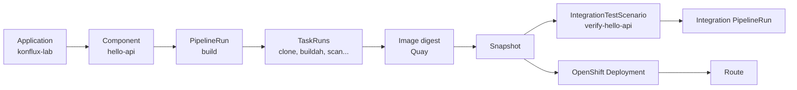

# konflux-lab architecture

Minimal Konflux learning application: one Python API, one component, one deployable unit.

## Runtime

| Object | Purpose |
|--------|---------|
| `hello-api` Deployment | Runs the Flask container on port 8080 |
| `hello-api` Service | Cluster DNS `hello-api:8080` |
| `hello-api` Route | Public HTTPS URL for Lab 7 |

## HTTP contract

| Endpoint | Response |
|----------|----------|
| `GET /` | `{"status":"ok","application":"konflux-lab"}` |
| `GET /health` | `{"status":"ok","service":"hello-api"}` |

## Konflux model

| Konflux concept | This repo |
|-----------------|-----------|
| Application | `konflux-lab` — product boundary |
| Component | `hello-api` — buildable unit under `components/hello-api/` |
| PipelineRun | `.tekton/konflux-lab-hello-api-*.yaml` (build on push/PR) |
| TaskRun | Child runs of the build PipelineRun (`git-clone`, `buildah`, …) |
| Snapshot | Immutable record of `hello-api` image digest after build |
| IntegrationTestScenario | `integration/verify-hello-api.yaml` |
| OpenShift Deployment | `deploy/openshift/hello-api.yaml` |
| Route | `deploy/openshift/route.yaml` |

## Build and deploy flow

1. Push code under `components/hello-api/`.
2. Pipeline-as-Code creates a build `PipelineRun`.
3. Tekton tasks build and push `hello-api` to Quay.
4. Konflux creates a `Snapshot` with the image digest.
5. Integration Service runs `konflux-lab-verify-hello-api` against the Snapshot.
6. You deploy the digest to a dev namespace and open the Route.

## Intentional omissions

No frontend, database, auth, GitOps, or multi-component coordination — only the Konflux primitives you need to learn.
