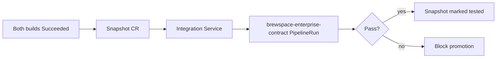

```mermaid
gantt
    title Brewspace api cj76v — actual vs expected
    dateFormat X
    axisFormat %S

    section Expected
    init           :done, 0, 30
    clone+oci      :done, 30, 120
    prefetch       :active, 120, 300
    build-container: 300, 900
    push+scans     : 900, 1500

    section Actual (live)
    init           :done, 0, 30
    clone git      :done, 30, 40
    oci push STUCK :crit, 40, 720
```

# Brewspace Runtime Forensic Analysis

**Principal finding (live cluster, 2026-06-01):** Your builds are **not stuck in Git clone**. Git checkout **completed successfully**. The `clone-repository` TaskRun remains **Running** because **`step-create-trusted-artifact` is retrying `oras push` to Quay**, and the registry returns:

```text
denied: System is currently read-only. Pulls will succeed but all write operations are currently suspended.
```

This is a **platform/registry incident**, not a brewspace application code defect.

**Incident case study:** [incident-quay-readonly.md](incident-quay-readonly.md)

---

## Live state summary (queried from `sfathii-tenant`)

| PipelineRun | Commit SHA | PipelineRun status | TaskRuns (now) | Root blocker |
|-------------|------------|-------------------|----------------|--------------|
| `brewspace-api-on-push-cj76v` | `ecf4b23147bb37b5ae4cfc356d95ec09dc312ba3` | Running (12m+) | `init` Succeeded; `clone-repository` Running | Quay read-only on `.git` OCI artifact push |
| `brewspace-api-on-push-kjfcg` | `bf9cbaab602e81b5c5cb603f89a20327ad6f63df` | Running (12m+) | Same pattern | Same (different commit) |
| `brewspace-frontend-on-push-t9w4r` | `ecf4b23147bb37b5ae4cfc356d95ec09dc312ba3` | Running (12m+) | Same pattern | Same on `brewspace-frontend:ecf4b23....git` |

**Pod evidence (`brewspace-api-on-push-cj76v-clone-repository-pod`):**

| Step | State | Time |
|------|--------|------|
| `step-clone` | **Completed** exit 0 | ~7s |
| `step-symlink-check` | **Completed** exit 0 | ~8s |
| `step-create-trusted-artifact` | **Running** (retry loop) | 12m+ |

**Clone log result:** commit `ecf4b231`, URL `https://github.com/tomswallaRH/dno-automation-services` — clone is fine.

**Latest Snapshot in namespace:** `brewspace-20260530-083833-000` (2d old) — contains **only `brewspace-frontend` digest**; annotation states **`brewspace-api` excluded** (missing valid containerImage/git). Integration on that snapshot: **`brewspace-enterprise-contract`** (TestPassed), **not** the `brewspace-verify-*` scenarios from this Git repo (those CRs are not on the cluster).

---

## Answers to your ten questions

### 1. What exact Pipeline should Konflux generate?

Konflux does **not** instantiate a separate `Pipeline` CR named in your Git repo for production builds. PaC creates a **`PipelineRun`** with an **inline `pipelineSpec`** equivalent to the Konflux catalog pipeline **`pipeline-docker-build-oci-ta`** (docker-build + OCI trusted artifacts).

| Source in repo | What it is |
|----------------|------------|
| `.tekton/brewspace-api-push.yaml` | PaC template → `PipelineRun` `brewspace-api-on-push-<suffix>` |
| `.tekton/brewspace-frontend-push.yaml` | PaC template → `PipelineRun` `brewspace-frontend-on-push-<suffix>` |
| `applications/brewspace/pipelines/brewspace-pipeline.yaml` | **Educational only** — not what PaC runs on push |

**Per-component params (from live template):**

| Param | brewspace-api | brewspace-frontend |
|-------|---------------|-------------------|
| `output-image` | `quay.io/redhat-user-workloads/sfathii-tenant/brewspace-api:{{revision}}` | `.../brewspace-frontend:{{revision}}` |
| `dockerfile` | `applications/brewspace/components/api/Containerfile` | `.../frontend/Containerfile` |
| `path-context` | `applications/brewspace/components/api` | `.../frontend` |
| `serviceAccountName` | `build-pipeline-brewspace-api` | `build-pipeline-brewspace-frontend` |

---

### 2. What TaskRuns should appear after `init` and `clone-repository`?

**Declared DAG order** (from `.tekton/brewspace-api-push.yaml`):

```text
init
  → clone-repository
    → prefetch-dependencies
      → build-container
        → build-image-index
          → [parallel] deprecated-base-image-check, clair-scan, ecosystem-cert-preflight-checks,
                       sast-snyk-check, clamav-scan, sast-shell-check, sast-unicode-check,
                       apply-tags, push-dockerfile, rpms-signature-scan
          → (optional) build-source-image  [when build-source-image=true — default false, skipped]
```

**After `init` Succeeded — expect exactly one new TaskRun:**

| Order | TaskRun name pattern | Tekton pipelineTask |
|-------|----------------------|---------------------|
| 2 | `<pr>-clone-repository` | `clone-repository` |

**After `clone-repository` Succeeded — expect:**

| Order | TaskRun | pipelineTask |
|-------|---------|--------------|
| 3 | `<pr>-prefetch-dependencies` | `prefetch-dependencies` |

**What you see today:** `clone-repository` still **Running** because the **git-clone-oci-ta** task includes multiple steps; UI maps the whole TaskRun to “clone-repository” while the hung step is **`create-trusted-artifact`** (OCI push of `SOURCE_ARTIFACT` to `quay.io/.../brewspace-api:<sha>.git`).

---

### 3. Which tasks are expected to take the longest?

| Rank | Task | Why (brewspace) |
|------|------|-----------------|
| 1 | **build-container** | UBI base pull + `pip install` + buildah layers (API); frontend lighter (nginx + static) |
| 2 | **prefetch-dependencies** | Python deps for API; frontend often faster (empty/minimal prefetch) |
| 3 | **Parallel scans** (wall-clock overlap) | clair, sast-snyk, clamav, etc. — many Pods |
| 4 | **clone-repository** | Normally 10–60s; **abnormal if 12m** → registry/OCI push (your case) |
| 5 | **init** | Seconds |

---

### 4. Which tasks are likely to fail first?

**In a healthy registry:**

| Probability | Task | Typical failure |
|-------------|------|----------------|
| High | **clone-repository** | Git auth (private fork) — *not your case; clone succeeded* |
| High | **prefetch-dependencies** | PyPI / proxy / requirements |
| High | **build-container** | Containerfile, base image, OOM |
| Medium | **build-image-index** | Quay push RBAC |
| Medium | **clair-scan** | CVE policy |
| Lower | init | SCC / scheduling |

**In your live incident (2026-06-01):**

| First failure point | Evidence |
|---------------------|----------|
| **clone-repository** (OCI artifact step) | Quay **read-only** on `oras push` for `*.git` artifact |
| Next failures (if retries exhaust) | Entire TaskRun Failed → PipelineRun Failed — **no prefetch, no image** |
| Same for all three PipelineRuns | api ×2 commits + frontend same commit |

---

### 5. Which images should be generated?

**On full success**, per PipelineRun:

| Component | Image reference (tag) | Digest result |
|-----------|----------------------|---------------|
| brewspace-api | `quay.io/redhat-user-workloads/sfathii-tenant/brewspace-api:<git-sha>` | `PipelineRun.status.results.IMAGE_DIGEST` |
| brewspace-frontend | `quay.io/redhat-user-workloads/sfathii-tenant/brewspace-frontend:<git-sha>` | same |

**OCI sidecar artifacts** (trusted-artifacts pipeline — also written to Quay):

| Artifact | Example tag suffix |
|----------|-------------------|
| Git source artifact | `:<sha>.git` |
| Prefetch artifact | `:<sha>.prefetch` |

**Your runs:** **No new container image** until `build-image-index` completes. Currently blocked **before** prefetch — no API/frontend image for `ecf4b231` / `bf9cbaa`.

---

### 6. Which Snapshot should be created?

**Intended:** Application **`brewspace`** Snapshot containing **both**:

- `brewspace-api@sha256:...`
- `brewspace-frontend@sha256:...`

**When:** After **both** component build PipelineRuns succeed for the same application build wave (Konflux controller logic).

**Your namespace today:**

- **No new Snapshot** for `ecf4b231` while all three PipelineRuns are stuck.
- Latest: `brewspace-20260530-083833-000` — **frontend-only**; api missing per annotation:

  `Component(s) 'brewspace-api' is(are) not included in snapshot due to missing valid containerImage or git`

**After recovery:** expect name like `brewspace-20260601-<time>-000` once both components publish valid digests.

---

### 7. Which IntegrationTestScenarios should run?

**In Git (repo):**

| CR name | File |
|---------|------|
| `brewspace-verify-api` | `applications/brewspace/integration/verify-api.yaml` |
| `brewspace-verify-frontend` | `applications/brewspace/integration/verify-frontend.yaml` |

**On cluster (live):**

```text
brewspace-enterprise-contract   (Application: brewspace)
```

**Not registered:** `brewspace-verify-api`, `brewspace-verify-frontend`.

**Implication:** Even after builds succeed, this cluster will run **enterprise-contract** integration against the Snapshot, not your learning-repo verify scenarios—until those CRs are applied and resolver URLs point to `tomswallaRH/dno-automation-services` (Git still has `example-org`).

---

### 8. Which Kubernetes resources should exist **during** the build?

**Per active PipelineRun** (you have **three** concurrent):

| Resource | Example |
|----------|---------|
| `PipelineRun` | `brewspace-api-on-push-cj76v` |
| `TaskRun` | `...-init`, `...-clone-repository` (more as pipeline advances) |
| `Pod` | `brewspace-api-on-push-cj76v-clone-repository-pod` (1/3 Ready while sidecar step runs) |
| `ServiceAccount` | `build-pipeline-brewspace-api` / `build-pipeline-brewspace-frontend` |
| `Secret` | `pac-gitauth-*` mounted as workspace `basic-auth` |
| `ConfigMap` | `trusted-ca`, `config-trusted-cabundle` (mounted in Pod) |
| Node selector | `konflux-ci.dev/workload=konflux-tenants` |

**Not expected** for this pipeline flavor: per-task **PVC** for source (OCI-TA uses registry artifacts).

**Triple load:** Two api PipelineRuns + one frontend = **3 clone Pods** hammering read-only Quay with retry loops.

---

### 9. Which resources should exist **after** a successful build?

| Resource | State |
|----------|--------|
| `PipelineRun` | `Succeeded` |
| `TaskRun` (all) | `Succeeded` |
| `Pod` | `Completed` (may be GC’d later) |
| Quay | Image `@sha256:...` + tags for commit |
| `Snapshot` | New row with api + frontend digests |
| Integration | New `PipelineRun`(s) e.g. `brewspace-enterprise-contract-*` |
| `Component` status | Updated `containerImage` / last build |

**After failed/stuck build (your now):**

| Resource | State |
|----------|--------|
| `PipelineRun` | `Running` (stuck) or eventual `Failed` |
| `TaskRun` clone | `Running` / later `Failed` |
| Quay | No new digest for this commit |
| `Snapshot` | Unchanged |
| Integration | Not triggered for this commit |

---

### 10. Timeline of expected execution

#### A) Expected timeline (healthy platform)

```text
T+0s     Git push (PaC webhook)
T+10s    PipelineRun created
T+30s    init Succeeded
T+1-3m   clone-repository Succeeded (clone + OCI .git push)
T+2-5m   prefetch-dependencies Succeeded
T+5-15m  build-container Succeeded        ← longest
T+16m    build-image-index Succeeded      ← image in Quay
T+16-25m parallel scans Succeeded
T+25m    PipelineRun Succeeded
T+26m    Snapshot assembled (if both components done)
T+30m+   Integration PipelineRun(s)
```

#### B) Actual timeline (your live builds, 2026-06-01)

```text
T+0s     Push triggers 3 PipelineRuns (2 api SHAs + 1 frontend)
T+10s    init Succeeded (all three)
T+20s    step-clone Completed (all three) ✓
T+30s    step-create-trusted-artifact starts oras push
T+30s…   RETRY LOOP — Quay read-only (12m+ and counting)
         prefetch-dependencies NOT STARTED
         No image, no Snapshot, no integration
```



---

## Expected TaskRun sequence (full)

```text
 1. init
 2. clone-repository          ← YOU ARE HERE (step-create-trusted-artifact)
 3. prefetch-dependencies
 4. build-container
 5. build-image-index
 6. deprecated-base-image-check      ┐
 7. clair-scan                       │
 8. ecosystem-cert-preflight-checks  │
 9. sast-snyk-check                   ├─ parallel (after 5)
10. clamav-scan                      │
11. sast-shell-check                 │
12. sast-unicode-check               │
13. apply-tags                       │
14. push-dockerfile                  │
15. rpms-signature-scan              ┘
(16. build-source-image — skipped, param false)
```

---

## Expected Pod sequence

One Pod per TaskRun (typical). Pod names:

```text
<pipelinerun>-init-pod
<pipelinerun>-clone-repository-pod          ← 3 containers; clone steps + OCI push
<pipelinerun>-prefetch-dependencies-pod
<pipelinerun>-build-container-pod           ← privileged buildah
<pipelinerun>-build-image-index-pod
<pipelinerun>-clair-scan-pod
... (one pod per parallel scan task)
```

---

## Expected image outputs

| Output | Repository |
|--------|------------|
| Container image | `quay.io/redhat-user-workloads/sfathii-tenant/brewspace-api:<sha>` |
| Container image | `quay.io/redhat-user-workloads/sfathii-tenant/brewspace-frontend:<sha>` |
| OCI SOURCE (.git) | `.../brewspace-api:<sha>.git` |
| OCI prefetch | `.../brewspace-api:<sha>.prefetch` |

**PipelineRun results keys:** `IMAGE_URL`, `IMAGE_DIGEST`, `CHAINS-GIT_URL`, `CHAINS-GIT_COMMIT`.

---

## Expected Snapshot outputs

```yaml
# Logical shape (API version may vary)
metadata:
  name: brewspace-20260601-HHMMSS-000
  labels:
    appstudio.openshift.io/application: brewspace
spec:
  application: brewspace
  components:
    - name: brewspace-api
      containerImage: quay.io/redhat-user-workloads/sfathii-tenant/brewspace-api@sha256:...
    - name: brewspace-frontend
      containerImage: quay.io/redhat-user-workloads/sfathii-tenant/brewspace-frontend@sha256:...
```

**Your cluster precedent:** Snapshot can be **partial** (frontend only) when api build did not produce a valid image.

---

## Expected Integration flow



**Repo scenarios (`verify-api`, `verify-frontend`):** require `oc apply -f applications/brewspace/integration/` and fix `resolverRef` URL to your fork.

---

## Failure points (ranked for your incident)

| # | Failure point | Symptom | Your status |
|---|---------------|---------|-------------|
| 1 | **Quay read-only** | `oras push` retry in `step-create-trusted-artifact` | **ACTIVE** |
| 2 | Duplicate api PipelineRuns | 2 SHAs, double quota/registry load | **ACTIVE** (`cj76v` + `kjfcg`) |
| 3 | Git auth | clone step fails | Ruled out (clone exit 0) |
| 4 | ResourceQuota | Pod Pending | Ruled out (Pod scheduled, Running) |
| 5 | prefetch / pip | After clone completes | Not reached yet |
| 6 | CVE scans | Late pipeline | Not reached |
| 7 | Integration resolver `example-org` | Would fail when scenarios applied | Latent in Git |

---

## Recovery actions

### Immediate (platform)

1. **Open ticket with Konflux/Quay platform team:** `quay.io/redhat-user-workloads` read-only — cite error verbatim from logs.
2. **Confirm registry maintenance window** — pulls work, writes suspended.
3. After read-only cleared, **cancel stuck PipelineRuns** or let them fail and re-push once.

```bash
export NS=sfathii-tenant
# optional: stop retry storm
oc cancel pipelinerun brewspace-api-on-push-cj76v -n $NS 2>/dev/null || \
  tkn pipelinerun cancel brewspace-api-on-push-cj76v -n $NS
```

### After registry restored

```bash
# Single empty commit to api path only (avoid duplicate api runs)
git commit --allow-empty -m "retrigger api after quay recovery"
# touch only one component per push when possible
git push origin main
```

**Avoid:** two rapid api pushes (`ecf4b231` vs `bf9cbaa`) — triggers duplicate `brewspace-api-on-push-*` runs.

### Application repo (secondary)

```bash
oc apply -f applications/brewspace/integration/verify-api.yaml -n sfathii-tenant
# Edit resolverRef url to https://github.com/tomswallaRH/dno-automation-services first
```

---

## Commands to validate every stage

```bash
export NS=sfathii-tenant
export PR=brewspace-api-on-push-cj76v

# Stage: PipelineRun exists
oc get pipelinerun $PR -n $NS

# Stage: init done
oc get taskrun ${PR}-init -n $NS -o jsonpath='{.status.conditions[0].reason}{"\n"}'

# Stage: clone — inspect STEPS not just TaskRun
POD=${PR}-clone-repository-pod
oc get pod $POD -n $NS -o jsonpath='{range .status.containerStatuses[*]}{.name}{"\t"}{.state}{"\n"}{end}'
oc logs $POD -n $NS -c step-create-trusted-artifact --tail=20

# Stage: clone git step succeeded?
oc logs $POD -n $NS -c step-clone --tail=10

# Stage: prefetch started? (expect no until clone TaskRun completes)
oc get taskrun -n $NS -l tekton.dev/pipelineRun=$PR

# Stage: image digest (only after build-image-index)
oc get pipelinerun $PR -n $NS -o jsonpath='{.status.results[?(@.name=="IMAGE_DIGEST")].value}{"\n"}'

# Stage: Snapshot
oc get snapshot -n $NS --sort-by=.metadata.creationTimestamp | tail -3
oc describe snapshot $(oc get snapshot -n $NS -o jsonpath='{.items[-1].metadata.name}') -n $NS

# Stage: Integration
oc get integrationtestscenario -n $NS
oc get pipelinerun -n $NS | grep enterprise-contract

# Compare all three stuck builds
for PR in brewspace-api-on-push-cj76v brewspace-api-on-push-kjfcg brewspace-frontend-on-push-t9w4r; do
  echo "=== $PR ==="
  oc get taskrun -n $NS -l tekton.dev/pipelineRun=$PR
  oc logs ${PR}-clone-repository-pod -n $NS -c step-create-trusted-artifact --tail=3 2>/dev/null
done
```

---

## What should I see in the next 10 minutes?

**Given:** `init` Succeeded, `clone-repository` Running (live: **12+ minutes** — abnormal).

### If Quay stays read-only (most likely without platform fix)

| Time | TaskRun | Pod / step | What you will see |
|------|---------|------------|-------------------|
| +0–10m | `clone-repository` still **Running** | `step-create-trusted-artifact` | Retry 10+ in logs; same `read-only` error |
| +10–20m | `clone-repository` → **Failed** (timeout/max retries) | Pod terminal | PipelineRun **Failed** |
| | **No** `prefetch-dependencies` | — | Pipeline cannot advance |
| | **No** new Snapshot | — | Old `brewspace-20260530-083833-000` remains latest |
| | **No** integration for `ecf4b231` | — | — |

**Parallel:** `kjfcg` and `t9w4r` follow the **same failure** (frontend log shows identical Quay error on `brewspace-frontend:ecf4b23....git`).

### If Quay write access is restored in the next 10 minutes

| Time | Expected next TaskRuns | Resources |
|------|------------------------|-----------|
| +0–2m | `clone-repository` → **Succeeded** | OCI `.git` artifact in Quay |
| +2–5m | `prefetch-dependencies` **Running → Succeeded** | New Pod; API pip prefetch |
| +5–12m | `build-container` **Running** | Privileged Pod; buildah logs |
| +12–15m | `build-image-index` **Succeeded** | `IMAGE_DIGEST` on PipelineRun |
| +15–25m | Parallel scan TaskRuns | Many Pods |
| +25m | PipelineRun **Succeeded** | Image `...@sha256` in Quay |

**Then (if both components succeed for same wave):**

| Time | Event |
|------|--------|
| +26–30m | New **Snapshot** with api + frontend digests |
| +30m+ | **brewspace-enterprise-contract** integration PipelineRun |

**You will NOT see** `brewspace-verify-api` until those IntegrationTestScenarios are applied to the cluster.

### What to run at T+2, T+5, T+10 minutes

```bash
watch -n30 'oc get taskrun -n sfathii-tenant -l tekton.dev/pipelineRun=brewspace-api-on-push-cj76v -o wide'
# When prefetch appears, clone stage truly finished:
oc get taskrun brewspace-api-on-push-cj76v-prefetch-dependencies -n sfathii-tenant 2>/dev/null
```

**Success signal in next 10 minutes:** log line `Pushed artifact` without `read-only` error, then TaskRun `brewspace-api-on-push-cj76v-prefetch-dependencies` appears.

---

## Debugging case study conclusion

| Question | Answer |
|----------|--------|
| Is brewspace misconfigured? | **No** — clone, paths, SA, and PaC triggers are working. |
| Why UI says clone Running? | Task bundles git clone + **OCI push**; push is hung. |
| Why three PipelineRuns? | Two api commits 20s apart + frontend same commit as `cj76v`. |
| What blocks Snapshot? | No successful image/OCI outputs for current SHAs. |
| Who fixes it? | **Platform/Quay** read-only first; then re-run builds. |

This is a **real-world** failure mode Jenkins rarely surfaces: the “checkout” stage completed, but **supply-chain artifact storage to the tenant registry** is down—Tekton keeps the TaskRun open while retries continue.

---

## References

- PaC: `.tekton/brewspace-api-push.yaml`, `.tekton/brewspace-frontend-push.yaml`
- [Lab 08 — Deep dive](../learning-labs/lab-08-deep-dive-build-execution.md)
- [PipelineRun Pending](../troubleshooting/pipelinerun-pending.md)

**Analysis generated from:** repository manifests + live `oc` queries against `sfathii-tenant` on 2026-06-01.
