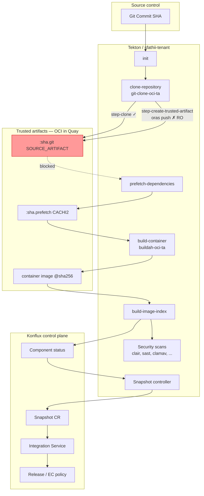
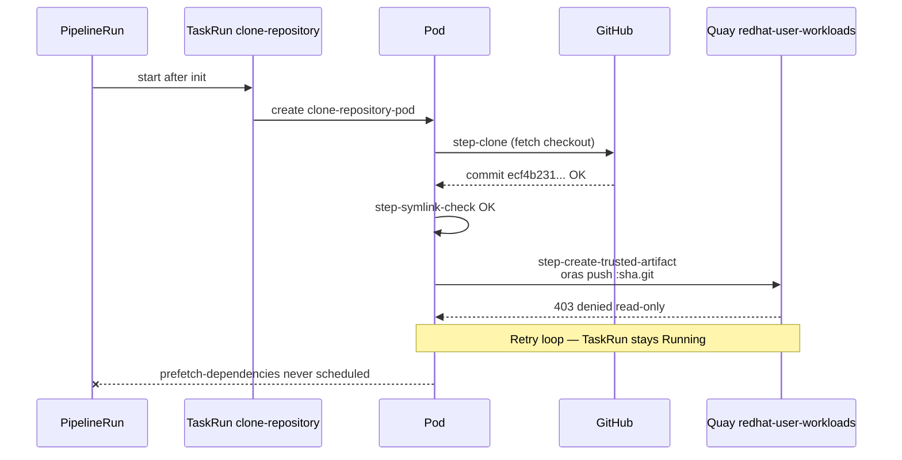
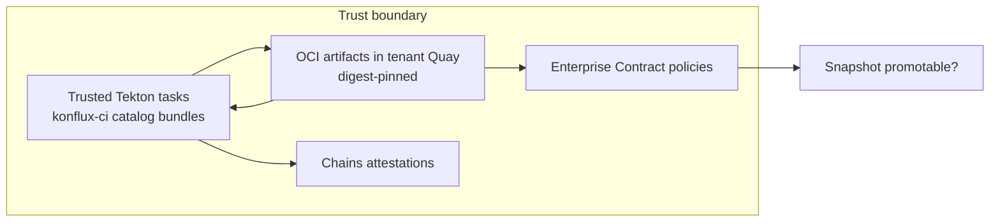
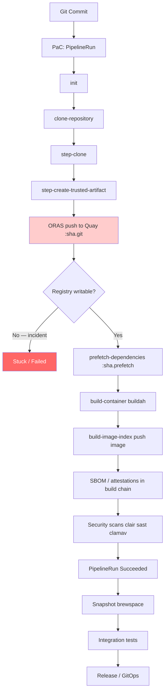

# Incident Case Study: Quay Read-Only Blocks Trusted Artifact Push

**Classification:** Platform / registry outage impacting Konflux builds  
**Application:** `brewspace` (`brewspace-api`, `brewspace-frontend`)  
**Namespace:** `sfathii-tenant`  
**Registry:** `quay.io/redhat-user-workloads/sfathii-tenant/`  
**Symptom:** `clone-repository` TaskRun **Running** indefinitely; downstream pipeline never starts  
**Root cause:** Quay returned **read-only** for write operations during `oras push` of OCI trusted artifacts  

**Representative error (live):**

```text
Executing: oras push ... quay.io/redhat-user-workloads/sfathii-tenant/brewspace-api:ecf4b23147bb37b5ae4cfc356d95ec09dc312ba3.git SOURCE_ARTIFACT
Error response from registry: denied: System is currently read-only.
Pulls will succeed but all write operations are currently suspended.
```

**Related analysis:** [brewspace-runtime-analysis.md](brewspace-runtime-analysis.md)

---

## Executive summary

Git checkout **succeeded** in under ten seconds. The Konflux **docker-build-oci-ta** pipeline then attempted to publish the cloned source tree as an **OCI trusted artifact** to Quay using **ORAS**. The registry rejected all writes. Tekton retried the push step, so the **TaskRun** stayed **Running**, the **PipelineRun** stayed **Running**, and **no subsequent tasks** (`prefetch-dependencies`, `build-container`, scans, Snapshot, integration) could run.

This is **not** a brewspace application defect. It is a **supply-chain storage / tenant registry** failure in the Konflux platform path.

---

## Supply-chain architecture (end-to-end)





---

## Deep technical analysis (11 questions)

### 1. What exactly is happening technically?

1. **Pipelines-as-Code** created `PipelineRun` objects (`brewspace-api-on-push-*`, `brewspace-frontend-on-push-*`) with embedded `pipelineSpec` (Konflux **pipeline-docker-build-oci-ta**).
2. Tekton scheduled **`init`** TaskRun → Pod ran → **Succeeded** (proxy/cache metadata).
3. Tekton scheduled **`clone-repository`** TaskRun using catalog task **`git-clone-oci-ta`**.
4. Inside Pod `*-clone-repository-pod`:
   - **`step-clone`**: cloned `https://github.com/tomswallaRH/dno-automation-services` at revision `ecf4b231...` → **exit 0**.
   - **`step-symlink-check`**: validated tree → **exit 0**.
   - **`step-create-trusted-artifact`**: packaged `/var/workdir/source` as OCI artifact `SOURCE_ARTIFACT` (digest `sha256:f1ccb7a25e...`) and invoked **`oras push`** to  
     `quay.io/redhat-user-workloads/sfathii-tenant/brewspace-api:ecf4b23147bb37b5ae4cfc356d95ec09dc312ba3.git`
5. Quay API responded **denied — system read-only** (writes suspended; pulls allowed).
6. The step **retries** (`warning: Command failed and will retry, N try`). Until the step completes or fails terminally, the **TaskRun** remains **Running**.
7. Tekton **does not** start **`prefetch-dependencies`** (`runAfter: clone-repository`) because the DAG edge requires **clone-repository TaskRun Succeeded**.

Net: the pipeline is blocked at **artifact persistence**, not at **source retrieval**.

---

### 2. Why is `clone-repository` trying to push artifacts to Quay?

The pipeline task name is historical (“clone-repository”). The implementation is **`git-clone-oci-ta`**: **clone + publish source as OCI artifact**.

From `.tekton/brewspace-api-push.yaml`:

```yaml
- name: clone-repository
  params:
  - name: ociStorage
    value: $(params.output-image).git   # → quay.io/.../brewspace-api:<sha>.git
  taskRef:
    name: git-clone-oci-ta
```

Konflux **docker-build-oci-ta** deliberately **does not** pass source only via PVC between tasks. It stores artifacts in the **same registry namespace** as the output image so that:

- Later tasks **pull by digest** (hermetic, reproducible).
- **Enterprise Contract** / **trusted-task** policy can verify that build inputs came from trusted Tekton tasks and known storage.

So “clone” in the UI = **clone to disk + push OCI artifact to Quay**.

---

### 3. What are trusted artifacts?

**Trusted artifacts** (Konflux [ADR-0036](https://konflux-ci.dev/architecture/ADR/0036-trusted-artifacts.html)) are build inputs/outputs stored as **OCI artifacts** in a registry, produced and consumed by **named Tekton tasks** from the **trusted catalog**, with provenance tracked for policy (e.g. Enterprise Contract `trusted_task.trusted`).

| Concept | Meaning |
|---------|---------|
| **Artifact** | OCI blob + manifest (not necessarily a container image) |
| **Trusted** | Created by a catalog TaskRun in a verified chain; digest-addressable |
| **vs PVC workspace** | No shared RWO volume; reduces tampering between tasks and nodes |

Examples in this pipeline:

| Artifact tag suffix | Producer task | Consumer task |
|--------------------|---------------|---------------|
| `:<sha>.git` | `clone-repository` | `prefetch-dependencies`, scans |
| `:<sha>.prefetch` | `prefetch-dependencies` | `build-container` |
| Container `@sha256:...` | `build-image-index` | Snapshot, integration, deploy |

---

### 4. Why does Konflux upload `.git` artifacts?

1. **Hermetic downstream tasks** — `prefetch-dependencies` and `build-container` read **`SOURCE_ARTIFACT`** by reference, not from a mutable workspace.
2. **Reproducibility** — Snapshot and policy bind to **digests**, including source artifact digest, not “whatever was on the node.”
3. **Provenance (Chains / EC)** — Links `CHAINS-GIT_COMMIT` / `CHAINS-GIT_URL` from clone results to later image attestation.
4. **Multi-step audit** — Security tasks (SAST) can use the same pinned source artifact as the build.
5. **Tenant isolation** — Artifacts live under `redhat-user-workloads/<tenant>/<component>:<sha>.git`, scoped to workload identity.

The `.git` suffix is a **tag convention** for the source OCI artifact, not “uploading `.git` directory only”—it is the packaged source tree from the clone.

---

### 5. What is ORAS?

**ORAS** ([OCI Registry As Storage](https://oras.land/)) is a CLI/library for pushing and pulling **OCI artifacts** (manifests + blobs) to OCI-compliant registries (Quay, registry.redhat.io, etc.).

In the incident logs:

```text
Executing: oras push --registry-config /tmp/create-oci.sh.*/auth-*.json \
  quay.io/redhat-user-workloads/sfathii-tenant/brewspace-api:<sha>.git SOURCE_ARTIFACT
```

| Role | Detail |
|------|--------|
| **Push** | Uploads artifact blobs and manifest |
| **Auth** | `--registry-config` uses token for `quay.io/redhat-user-workloads/sfathii-tenant/brewspace-api` |
| **Label** | `SOURCE_ARTIFACT` identifies artifact type in manifest |

Container images are one OCI artifact type; Konflux also stores **source** and **prefetch** artifacts as separate tags/digests.

---

### 6. How trusted artifacts fit Konflux supply-chain security



| Layer | Function |
|-------|----------|
| **Trusted tasks** | Only catalog tasks (e.g. `git-clone-oci-ta`, `buildah-oci-ta`) produce valid artifacts |
| **Registry storage** | Artifacts immutable by digest; tags like `:sha.git` are pointers |
| **Policy** | EC verifies pipeline used trusted tasks and expected artifact flow |
| **Snapshot** | Application state = component image digests that passed build + test |
| **Integration / Release** | Downstream only sees digests that went through this chain |

**Read-only Quay** breaks the chain at the **first write**: no source artifact → policy cannot attest a complete trusted path → no image → no Snapshot.

---

### 7. What would happen if this step were skipped?

| If skipped | Consequence |
|------------|-------------|
| **Hypothetically: clone only, no push** | `prefetch-dependencies` would not resolve `SOURCE_ARTIFACT` from `$(tasks.clone-repository.results.SOURCE_ARTIFACT)` — task would fail or pull wrong/missing data. |
| **Bypass to PVC pipeline** | Would require a **different pipeline template** (non-OCI-TA). Not what PaC applied; would fail EC trusted-task checks on Konflux. |
| **Manual skip in cluster** | Unsupported; undermines hermetic build and invalidates supply-chain guarantees. |

Konflux does not offer a supported “skip OCI push” flag for production docker-build-oci-ta—**the push is the handoff mechanism**.

---

### 8. Why the build cannot continue

Tekton DAG enforcement:

```text
prefetch-dependencies.runAfter: [clone-repository]
build-container.runAfter: [prefetch-dependencies]
build-image-index.runAfter: [build-container]
scans.runAfter: [build-image-index]
```

| Gate | Requirement |
|------|-------------|
| Task scheduling | Previous task **Succeeded** |
| Parameter binding | `SOURCE_ARTIFACT` / `CACHI2_ARTIFACT` results from prior tasks |
| Konflux Snapshot | Build PipelineRun **Succeeded** + valid `containerImage` |
| Integration | Snapshot exists with valid component digests |

With `clone-repository` stuck **Running**:

- No `SOURCE_ARTIFACT` result registered on TaskRun.
- **prefetch-dependencies** never created.
- **No image**, **no Snapshot** for commit `ecf4b231`, **no integration** for this build wave.

---

### 9. Which Tekton step is responsible?

| UI / TaskRun name | Catalog task | Pod step (live) | Responsibility |
|-------------------|--------------|-----------------|----------------|
| **`clone-repository`** | `git-clone-oci-ta` | `step-clone` | Git fetch/checkout ✓ |
| same | same | `step-symlink-check` | Tree validation ✓ |
| same | same | **`step-create-trusted-artifact`** | **ORAS push — FAILED** |

**Responsible step for the incident:** **`step-create-trusted-artifact`** inside TaskRun **`brewspace-api-on-push-cj76v-clone-repository`** (and equivalents for `kjfcg`, `t9w4r`).

---

### 10. Which Kubernetes resources participate

| Resource | Role in this step |
|----------|-------------------|
| **`PipelineRun`** | Owns overall build; stays Running |
| **`TaskRun`** | `*-clone-repository`; status Running |
| **`Pod`** | `*-clone-repository-pod`; 1/3 Ready while step retries |
| **`ServiceAccount`** | `build-pipeline-brewspace-api` / `build-pipeline-brewspace-frontend` — Quay push identity |
| **`Secret`** | `pac-gitauth-*` — Git clone auth (worked); separate from Quay push token |
| **`ConfigMap`** | `trusted-ca`, `config-trusted-cabundle` — TLS trust for registry |
| **Node** | `konflux-ci.dev/workload=konflux-tenants` — build farm |
| **Namespace** | `sfathii-tenant` — quota applies to all retry Pods |

**Not involved in this failure:** PVC for source (OCI-TA path), Deployment/Route (runtime), Integration Pods.

---

### 11. Which Konflux resources depend on success of this step

| Konflux resource | Dependency |
|------------------|------------|
| **Component** (`brewspace-api`) | `lastBuild`, container image URL/digest — not updated until pipeline completes |
| **Application** (`brewspace`) | Aggregated build health |
| **Snapshot** | Requires successful build + valid `containerImage`; api was **excluded** from prior snapshot when build missing |
| **IntegrationTestScenario** | Triggered after Snapshot (e.g. `brewspace-enterprise-contract`) |
| **Enterprise Contract** | Attestation over trusted task chain — incomplete if clone task never succeeds |
| **Release / ReleasePlan** | Promotable Snapshot never created |

---

## Full pipeline timeline (intended vs blocked)



**SBOM note:** This pipeline does not expose a separate UI task named `sbom`; SBOM and attestation data are produced within **buildah-oci-ta** / Chains integration as part of **build-container** → **build-image-index**, then consumed by **security scans** and **Enterprise Contract**.

---

## How I would debug this as a Konflux SRE

### Phase 1 — Confirm scope (2 minutes)

```bash
export NS=sfathii-tenant

# All stuck brewspace builds?
for PR in $(oc get pipelinerun -n $NS -l appstudio.openshift.io/application=brewspace \
  -o jsonpath='{range .items[?(@.status.conditions[0].reason=="Running")]}{.metadata.name}{"\n"}{end}'); do
  echo "=== $PR ==="
  oc get taskrun -n $NS -l tekton.dev/pipelineRun=$PR \
    -o custom-columns=TASK:.metadata.labels.tekton\.dev/pipelineTask,REASON:.status.conditions[0].reason
done
```

**Expect:** Only early tasks; many PipelineRuns on **clone-repository Running**.

---

### Phase 2 — PipelineRun (1 minute)

```bash
export PR=brewspace-api-on-push-cj76v

oc get pipelinerun $PR -n $NS \
  -o custom-columns=NAME:.metadata.name,REASON:.status.conditions[0].reason,MSG:.status.conditions[0].message

oc get pipelinerun $PR -n $NS -o jsonpath='{range .metadata.annotations}{@}{"\n"}{end}' | grep -E 'commit|repo'
```

**SRE signal:** `reason=Running` for 10m+ with only two TaskRuns → not a slow compile; early-stage hang.

---

### Phase 3 — TaskRuns (1 minute)

```bash
oc get taskrun -n $NS -l tekton.dev/pipelineRun=$PR -o wide

oc describe taskrun ${PR}-clone-repository -n $NS | sed -n '/Conditions:/,/Events:/p'
```

**SRE signal:** `clone-repository` **Running**, no `prefetch-dependencies` object → DAG blocked at clone task.

---

### Phase 4 — Pod step matrix (critical — 3 minutes)

Do **not** trust the task name alone.

```bash
POD=${PR}-clone-repository-pod
oc get pod $POD -n $NS -o jsonpath='{range .status.containerStatuses[*]}{.name}{"\t"}{.state}{"\n"}{end}'
```

| Step | Healthy | Incident |
|------|---------|----------|
| `step-clone` | `terminated.exitCode: 0` | **0** ✓ |
| `step-symlink-check` | exit 0 | **0** ✓ |
| `step-create-trusted-artifact` | exit 0 quickly | **`running` 12m+** |

---

### Phase 5 — Logs (smoking gun — 2 minutes)

```bash
oc logs $POD -n $NS -c step-clone --tail=20
oc logs $POD -n $NS -c step-create-trusted-artifact --tail=40
```

**Look for:**

- `Prepared artifact from /var/workdir/source`
- `Executing: oras push`
- `read-only` / `write operations are currently suspended`

**If you see that:** escalate to **Quay / Konflux platform** — not application team.

---

### Phase 6 — Registry validation (5 minutes)

```bash
# SA used for push
oc get sa build-pipeline-brewspace-api -n $NS -o yaml | grep -A3 secrets

# Manual write test (if platform provides credentials — often ticket-only)
# curl -v https://quay.io/v2/redhat-user-workloads/sfathii-tenant/brewspace-api/blobs/uploads/
```

| Test | Read-only incident | Auth issue |
|------|-------------------|------------|
| `oras push` from build pod | **read-only** message | `unauthorized` / `denied` without RO wording |
| `docker pull` same repo | Works | May fail on different creds |
| Other tenants | Same error → global RO | Isolated → quota/permission |

Check **multiple components** (`brewspace-frontend`) — same error → **registry-wide** for tenant or org.

---

### Phase 7 — Blast radius

```bash
oc get pipelinerun -n $NS --field-selector=status.conditions[0].reason=Running --no-headers | wc -l
oc get snapshot -n $NS --sort-by=.metadata.creationTimestamp | tail -3
```

Document: no new Snapshot, duplicate api PipelineRuns (`cj76v` + `kjfcg`) amplify retry load.

---

### Recovery procedures

| Step | Action | Owner |
|------|--------|-------|
| 1 | Confirm Quay `redhat-user-workloads` write path restored | Platform |
| 2 | Cancel stuck PipelineRuns to stop retry storm | SRE / user |
| 3 | Re-trigger **one** build per component (single commit) | User |
| 4 | Verify `clone-repository` Succeeded in &lt;5m | SRE |
| 5 | Verify `prefetch-dependencies` → `build-container` → `IMAGE_DIGEST` | SRE |
| 6 | Confirm new **Snapshot** includes **both** api and frontend | SRE |
| 7 | Post-incident: alert on `read-only` in build logs | Platform |

```bash
# Cancel (use tkn or Tekton CRD per cluster version)
tkn pipelinerun cancel $PR -n $NS

# After registry fix — watch next run
watch -n15 'oc get taskrun -n $NS -l tekton.dev/pipelineRun='$PR' -o wide'
```

**Do not:** repeatedly push to `main` while RO — creates duplicate PipelineRuns (`kjfcg` + `cj76v`) and multiplies failed `oras` attempts.

---

## Lessons learned

### What I initially assumed

| Assumption | Why it felt plausible |
|------------|----------------------|
| **“Clone is slow”** | TaskRun named `clone-repository` was **Running** for 12+ minutes |
| **Git / PaC misconfiguration** | New fork, learning repo, `example-org` in some YAML |
| **brewspace code or Containerfile** | Recent push to `components/api` |
| **Quota / Pending scheduler** | Common Konflux doc topics |
| **Need to fix Snapshot or integration first** | Downstream symptoms missing |

### What evidence disproved each assumption

| Evidence | Disproves |
|----------|-----------|
| `step-clone` **exitCode 0** in &lt;10s with correct `commit` and `url` | Git auth, wrong branch, shallow clone failure |
| Pod **Scheduled** on `konflux-ci.dev/workload=konflux-tenants` node | Quota / unschedulable (for this pod) |
| Log: `Prepared artifact from /var/workdir/source` then **`oras push`** errors | Application compile/test issues (not reached) |
| Exact string **`System is currently read-only`** | RBAC typo on SA (different error shape) |
| **frontend** Pod same error on `brewspace-frontend:...git` | api-only Dockerfile bug |
| No `prefetch-dependencies` TaskRun object exists | Intentional skip or UI lag — actually **DAG blocked** |

### How the investigation narrowed the problem

```text
PipelineRun Running
  → list TaskRuns → only init + clone-repository
    → describe Pod → 1/3 Ready (multi-step)
      → per-step container state → clone done, create-trusted-artifact running
        → logs step-create-trusted-artifact → oras push read-only
          → classify: registry platform incident
```

**Turning point:** Inspecting **step-level** container status, not only Tekton task labels. Konflux UI maps all steps to one task: **“clone-repository.”**

### Why the root cause is platform-related, not application-related

| Criterion | Application issue | This incident |
|-----------|-------------------|---------------|
| Repro across components | Maybe one image | **api + frontend**, same error |
| Fails before app build | Rare | **Before** `prefetch-dependencies` |
| Source in Git | Would fail compile/test | **Clone succeeded** |
| Registry message | N/A | Explicit **global read-only** on writes |
| Fix location | Containerfile, deps | **Quay availability** / Konflux ops |

**brewspace** did its job: commit reached the cluster, Git was fetched, tree was packaged. **Konflux supply-chain storage** could not accept the artifact — that is **platform SLO**, not **application CI**.

---

## Prevention and observability recommendations

| Recommendation | Rationale |
|----------------|-----------|
| Alert on `read-only` in `step-create-trusted-artifact` logs | Early platform detection |
| Dashboard: TaskRun `clone-repository` duration p99 | &gt;5m anomaly |
| Runbook link from Konflux UI “Running too long” | Point to step-level `oc` checks |
| Avoid duplicate pushes during incident | Reduces registry retry load |
| Document OCI-TA in onboarding | Engineers expect “clone” ≠ “git only” |

---

## References

- Repo: `.tekton/brewspace-api-push.yaml` (`ociStorage: $(params.output-image).git`)
- Konflux ADR: [Trusted Artifacts](https://konflux-ci.dev/architecture/ADR/0036-trusted-artifacts.html)
- ORAS: https://oras.land/
- Related: [brewspace-runtime-analysis.md](brewspace-runtime-analysis.md), [pipelinerun-pending.md](../troubleshooting/pipelinerun-pending.md)

---

**Case study status:** Closed pending platform restoration of Quay write path; rebuild required for affected SHAs (`ecf4b231`, `bf9cbaa`).
