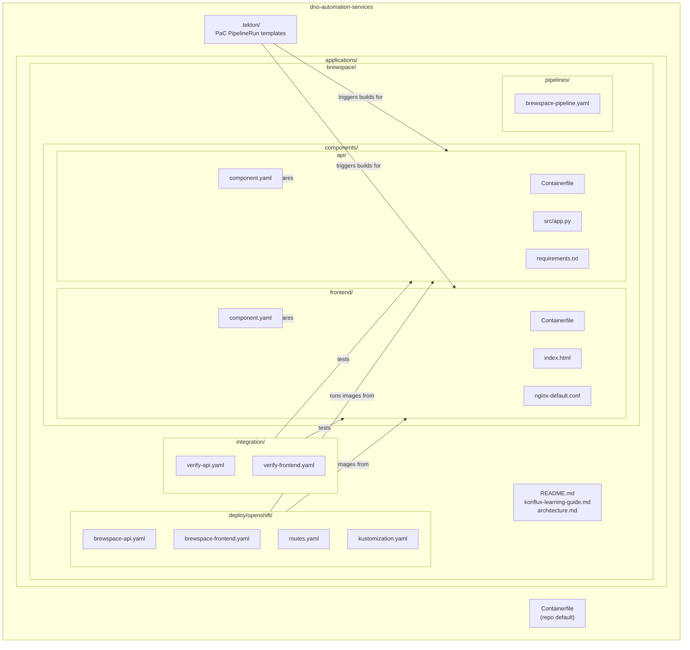

# Repository Structure Diagram

## Diagram

## Explanation

This repository is a Konflux learning workspace centered on the **brewspace** application. Source code lives under `applications/brewspace/components/` as two independently buildable units: a Flask **api** and an NGINX **frontend**. Konflux metadata (`component.yaml`) and Pipeline-as-Code templates (`.tekton/`) tell the platform how to build each unit. **Integration** scenarios under `integration/` define post-build validation against Snapshots. **Deploy** manifests under `deploy/openshift/` are ordinary OpenShift resources used after images are built and promoted—they are not Konflux CRs, but they complete the end-to-end story from CI to runtime.

## How this appears in Konflux UI

| Repo path | Konflux UI |
|-----------|------------|
| `applications/brewspace` (Application CR, when onboarded) | **Applications** → **brewspace** groups both components |
| `components/api/component.yaml` | **Components** → **brewspace-api** with source context `.../components/api` |
| `components/frontend/component.yaml` | **Components** → **brewspace-frontend** with source context `.../components/frontend` |
| `.tekton/brewspace-*-push.yaml` | **Pipelines** tab on each component; **Pipeline runs** after Git push |
| `integration/verify-*.yaml` | **Integration tests** under the brewspace application |
| `deploy/openshift/` | Not shown in Konflux UI; applied with `oc apply -k` in a workload namespace |

## How this maps to Tekton resources

| Repo path | Tekton / related resources |
|-----------|----------------------------|
| `.tekton/brewspace-api-push.yaml` | `PipelineRun` `brewspace-api-on-push` (labels: `appstudio.openshift.io/component=brewspace-api`) |
| `.tekton/brewspace-frontend-push.yaml` | `PipelineRun` `brewspace-frontend-on-push` |
| `.tekton/*-pull-request.yaml` | `PipelineRun` templates for PR events |
| `pipelines/brewspace-pipeline.yaml` | Educational `Pipeline` `brewspace-build-and-verify` (multi-task example; production uses per-component docker-build bundles in PaC) |
| `components/*/Containerfile` | Referenced by `PipelineRun` params `dockerfile` and `path-context` |
| `integration/*.yaml` | Resolved by Integration Service into additional `PipelineRun`s bound to a `Snapshot` |
