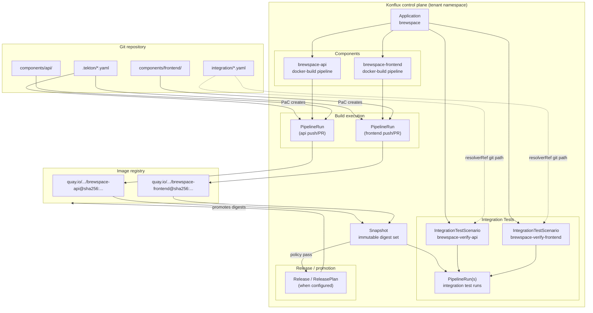

# Konflux Application Model Diagram

## Diagram

## Explanation

Konflux organizes work around an **Application** (`brewspace`), which owns **Components** (`brewspace-api`, `brewspace-frontend`). Each component declares its Git context and build pipeline type. Git events create **PipelineRuns** that produce container images in Quay. When builds for the application complete, Konflux assembles a **Snapshot**—a frozen record of image digests for that application state. **IntegrationTestScenario** resources (defined in `integration/verify-*.yaml`) run Tekton pipelines against that Snapshot before anything is promoted. Promotion ties tested digests to downstream environments rather than mutable tags.

## How this appears in Konflux UI

- **Application** `brewspace`: top-level card listing components, recent builds, snapshots, and integration test status.
- **Components** `brewspace-api` / `brewspace-frontend`: source URL, context path, last build result, image pull spec, pipeline type (`docker-build`).
- **Pipeline runs**: per-component build history with logs, params, and task results (`IMAGE_DIGEST`, `IMAGE_URL`).
- **Snapshots**: timeline of application states; drill-down shows each component digest at that point in time.
- **Integration tests**: scenarios `brewspace-verify-api` and `brewspace-verify-frontend` with pass/fail per Snapshot.
- **Releases** (if enabled): planned promotions from a tested Snapshot to environments.

## How this maps to Tekton resources

| Konflux concept | Primary Kubernetes / Tekton objects |
|-----------------|-------------------------------------|
| Application | `Application` CR `appstudio.redhat.com/v1alpha1` |
| Component | `Component` CR; annotation `build.appstudio.openshift.io/pipeline: docker-build` |
| Build | `PipelineRun` with label `pipelines.appstudio.openshift.io/type: build` |
| Pipeline definition | Embedded `pipelineSpec` in PaC template or Tekton bundle `pipeline-docker-build-oci-ta` |
| Tasks | `TaskRun`s: `git-clone`, `buildah`, `prefetch-dependencies`, `clamav-scan`, `ecosystem-check`, etc. |
| Snapshot | `Snapshot` CR referencing component image digests |
| Integration test | `IntegrationTestScenario` → Integration Service creates `PipelineRun` with Snapshot context |
| Snapshot assembly | Konflux controllers / build service (not a single file in this repo) |
