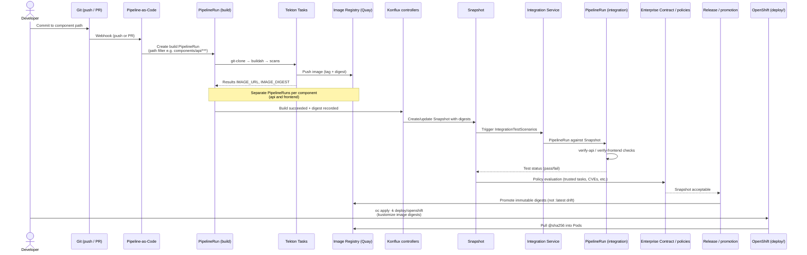

# CI/CD Flow Diagram

## Diagram

## Explanation

The brewspace CI/CD path starts when a developer pushes code or opens a PR. **Pipeline-as-Code** reads `.tekton/` templates, evaluates CEL path filters, and instantiates a **build PipelineRun** for the affected component. Tekton tasks clone source, build with Buildah, run checks, and push to **Quay**. Konflux records digests and forms a **Snapshot** representing one coherent application build. **Integration tests** run as separate PipelineRuns against that Snapshot. Policy gates (Enterprise Contract) must pass before **promotion**. Deployment in this repo is manual OpenShift apply using digests from Kustomize—Konflux builds and tests; `deploy/openshift/` runs the result.

## How this appears in Konflux UI

1. **Activity** after push: new Pipeline run on the component (Running → Succeeded/Failed).
2. **Component** page: latest image pull spec with digest.
3. **Application** → **Snapshots**: new entry when all required component builds complete.
4. **Integration tests**: runs linked to the Snapshot; green/red per scenario.
5. **Security / compliance** panels: task trust, vulnerability scan outcomes from build tasks.
6. **Release** (optional): promotion request from a passing Snapshot.

## How this maps to Tekton resources

| Stage | Tekton / K8s resources |
|-------|-------------------------|
| Git Push | PaC `Repository` CR; annotations on `PipelineRun` templates in `.tekton/` |
| Component Build | `PipelineRun` (`brewspace-api-on-push`, `brewspace-frontend-on-push`, PR variants) |
| Clone / build | `TaskRun` from bundles: `task-git-clone-oci-ta`, `task-buildah-oci-ta`, … |
| Image Registry | `PipelineRun` results + `build.appstudio.redhat.com` annotations; image written to `output-image` param |
| Snapshot | `Snapshot` CR; component status propagated from build PipelineRuns |
| Integration Tests | `PipelineRun` created by Integration Service; may reference Snapshot in params/labels |
| Promotion | `Release`, `ReleasePlan`, `ReleasePlanAdmission` (environment-specific; not in this learning repo) |
| Deployment | Standard `Deployment` / `Service` / `Route`—outside Tekton, applied via `kubectl`/`oc` |

**Path filter example (api push):** changes under `applications/brewspace/components/api/***` or `.tekton/brewspace-api-push.yaml` trigger `brewspace-api-on-push`.
