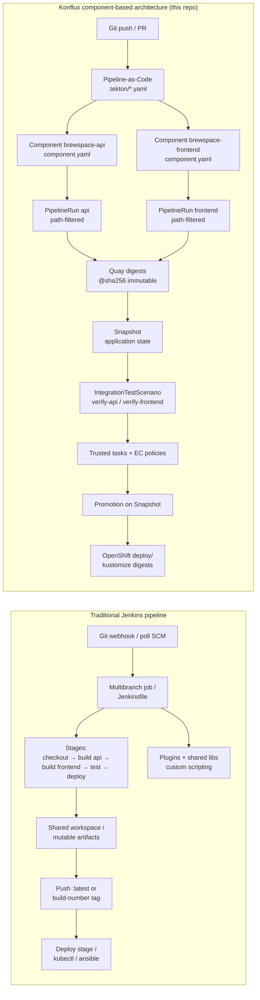

# Jenkins vs Konflux Comparison Diagram

## Diagram

## Explanation

**Jenkins** typically centralizes orchestration in one job or `Jenkinsfile`: stages build multiple artifacts in sequence or parallel, often from one workspace, and pass mutable tags or build numbers to deploy steps. Logic lives in Groovy, plugins, and operator-maintained job config.

**Konflux** (as modeled in brewspace) splits the monolith into **first-class Components**, each with its own Git context, PaC template, and build PipelineRun. Images are identified by **digest**, grouped into a **Snapshot**, and validated by declarative **IntegrationTestScenario** resources. Policy and provenance are platform concerns, not custom pipeline code. Deploy manifests in Git are applied separately once a Snapshot is trusted.

| Aspect | Jenkins (typical) | Konflux (brewspace repo) |
|--------|-------------------|---------------------------|
| Unit of build | Job / stage | Component |
| Trigger config | Job UI + Jenkinsfile | `.tekton/` + CEL in PaC |
| Artifact identity | Tags, archives | Image digest in Quay |
| “What we tested” | Often implicit | Snapshot CR |
| Integration tests | Custom stages | `IntegrationTestScenario` |
| Orchestration | Groovy | Tekton + controllers |

## How this appears in Konflux UI

Konflux has no Jenkins job list. Instead you see:

- **Applications** and **Components** instead of foldered jobs.
- **Pipeline runs** (Tekton) instead of `#1234` Jenkins build numbers—each run is a Kubernetes object with task-level logs.
- **Snapshots** and **Integration tests** as first-class navigation—no equivalent in default Jenkins UI without custom dashboards.
- **Compliance** views for trusted tasks and vulnerabilities—usually Jenkins plugins or external tools.

Jenkins Blue Ocean / stage view maps loosely to Tekton **PipelineRun** task graph in the OpenShift/Konflux console.

## How this maps to Tekton resources

| Jenkins concept | Konflux / Tekton equivalent in this repo |
|-----------------|------------------------------------------|
| Jenkinsfile `pipeline {}` | `PipelineRun` `pipelineSpec` in `.tekton/brewspace-*-push.yaml` |
| `stage('Build')` | `TaskRun` sequences (buildah, git-clone, …) |
| Shared library | Tekton **bundles** from `quay.io/konflux-ci/tekton-catalog` |
| Job parameter | `PipelineRun` `params` (`git-url`, `revision`, `output-image`, …) |
| Multibranch path filter | PaC `on-cel-expression` pathChanged() |
| Downstream job trigger | Integration Service creating PipelineRuns from Snapshot |
| Archive artifacts | OCI images + Snapshot digest references |
| Deploy stage | Out of band: `applications/brewspace/deploy/openshift/` |

The educational `pipelines/brewspace-pipeline.yaml` shows a **multi-component Tekton Pipeline** in one run; production Konflux setup here uses **one PipelineRun per component** (closer to independent Jenkins multibranch jobs per module).
