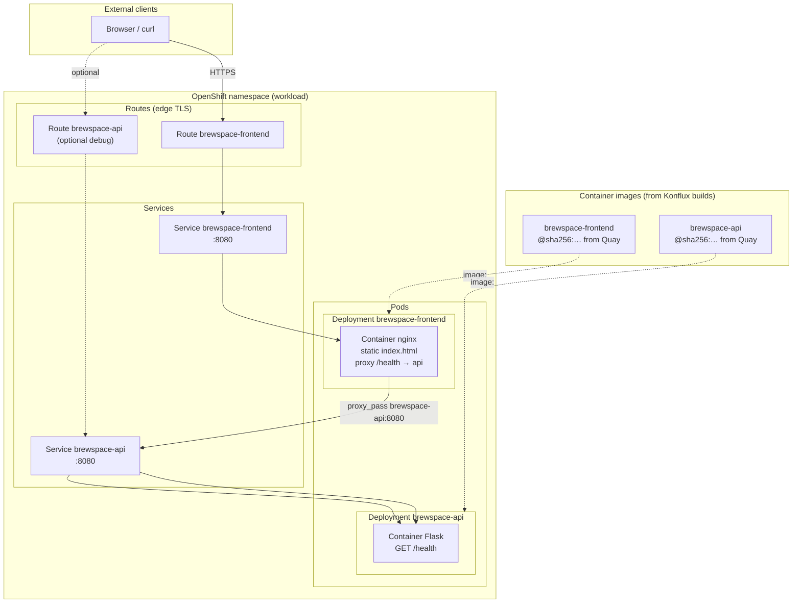

# Runtime Architecture Diagram

## Diagram

## Explanation

At runtime, brewspace runs on OpenShift outside the Konflux tenant namespace. The **frontend** pod serves static HTML on `/` and proxies `/health` to the **API** service via NGINX (`nginx-default.conf`). The **API** pod runs Flask and exposes `GET /health`. **Services** provide cluster DNS (`brewspace-api`, `brewspace-frontend`). **Routes** expose the frontend (primary user entry) and optionally the API for debugging. Container images are the immutable digests built by Konflux and referenced in `kustomization.yaml`—not mutable `:latest` in production.

## How this appears in Konflux UI

Runtime resources are **not** managed inside Konflux UI:

- Konflux shows **built images** and digests on each Component.
- **Snapshots** prove which digests were tested together.
- Deployments, Routes, and Services appear in the **OpenShift console** (Topology, Workloads → Deployments).

To connect UI workflows: copy digest from Component build → `kustomize edit set image` → `oc apply -k applications/brewspace/deploy/openshift`.

## How this maps to Tekton resources

Runtime is **downstream of Tekton**, not Tekton itself:

| Runtime object | Relationship to Tekton |
|----------------|------------------------|
| `Deployment` / `Pod` | Runs image built by build `PipelineRun` (`output-image` param → Quay digest) |
| `Service` | Cluster networking; no Tekton object |
| `Route` | OpenShift ingress; no Tekton object |
| Image pull | Digest from `PipelineRun` results `IMAGE_DIGEST` / Snapshot component status |

Integration test `PipelineRun`s may curl `/health` against test fixtures; production health checks use Kubernetes `readinessProbe` / `livenessProbe` on `/health` (api) and `/` (frontend) in the Deployment manifests.

**Files in this repo:**

- `deploy/openshift/brewspace-api.yaml` — Deployment + Service
- `deploy/openshift/brewspace-frontend.yaml` — Deployment + Service
- `deploy/openshift/routes.yaml` — Routes to both Services
- `deploy/openshift/kustomization.yaml` — image name substitutions for digests
