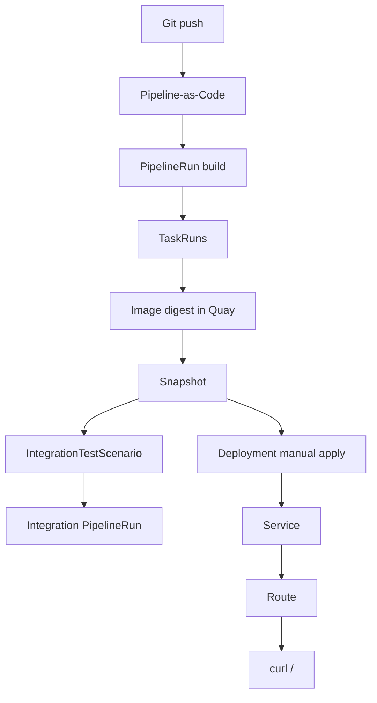

# konflux-lab learning path

Principal-engineer guide for learning Konflux with the smallest useful application in this repository.

**Application:** `konflux-lab`  
**Component:** `hello-api`  
**Success check:** `curl https://<route>/` returns `{"status":"ok","application":"konflux-lab"}`

Stop using brewspace for debugging. Use this path only.

---

## Before you start

| Requirement | Why |
|-------------|-----|
| Konflux / Developer Hub access | Create Application and Component |
| `oc` logged in | Inspect PipelineRuns, Snapshots, deploy |
| Git fork of `dno-automation-services` | Push triggers PaC builds |
| A dev namespace for Deployments | Tenant namespaces are usually build-only |

Substitute `<tenant-namespace>`, `<tenant>`, and Git URLs throughout.

---

## Lab 1 — Create Application

**Goal:** Understand the Application as a product boundary.

### What to create

| Object | File | Name |
|--------|------|------|
| Application | `applications/konflux-lab/application.yaml` | `konflux-lab` |

### Steps

1. Open Developer Hub → **Applications** → **Create application** → `konflux-lab`.
2. Or apply `application.yaml` to your tenant namespace.
3. Confirm: `oc get application konflux-lab -n <tenant-namespace>`.

### What you should learn

- An **Application** groups Components, Snapshots, and integration tests.
- It is **not** a pipeline and does **not** run builds.
- Jenkins analogy: a folder name, not a job.

### Check yourself

- Can you explain what lives under an Application vs what lives under a Component?
- Can you find `konflux-lab` in the UI without opening a PipelineRun?

---

## Lab 2 — Create Component

**Goal:** Understand the Component as the buildable unit.

### What to create

| Object | File | Name |
|--------|------|------|
| Component | `applications/konflux-lab/components/hello-api/component.yaml` | `hello-api` |

### Steps

1. Update `spec.source.git.url` to your fork.
2. Create the Component in the UI or `oc apply -f component.yaml`.
3. Verify source context: `applications/konflux-lab/components/hello-api`.
4. Note annotation `build.appstudio.openshift.io/pipeline: docker-build`.

### What you should learn

- A **Component** maps to one source path, one Containerfile, one image output.
- `component.yaml` is declarative metadata — the platform reads it to know *what* to build.
- Jenkins analogy: one multibranch job scoped to a subdirectory.

### Check yourself

- Where is the Flask code relative to the Component context?
- What image name will Konflux publish?

---

## Lab 3 — Trigger Build

**Goal:** Connect Git events to Konflux builds.

### What triggers the build

| File | Event |
|------|-------|
| `.tekton/konflux-lab-hello-api-push.yaml` | Push to `main` |
| `.tekton/konflux-lab-hello-api-pull-request.yaml` | Pull request |

Path filter: changes under `applications/konflux-lab/components/hello-api/`.

### Steps

1. Make a small change (for example a comment in `src/app.py`).
2. Push to `main` or open a PR.
3. Watch for a new PipelineRun on component `hello-api`.

### What you should learn

- **Pipeline-as-Code** turns Git events into `PipelineRun` objects.
- Builds are path-scoped — unrelated directories do not rebuild this Component.
- Jenkins analogy: webhook trigger, but the trigger definition lives in Git (`.tekton/`).

### Check yourself

- Which file would you edit to change the push path filter?
- What label identifies this as a build PipelineRun?

---

## Lab 4 — Observe PipelineRun

**Goal:** Read a build execution as Tekton objects, not only as console text.

### Objects to inspect

| Object | Command / UI |
|--------|----------------|
| PipelineRun | `oc get pipelinerun -l appstudio.openshift.io/component=hello-api` |
| TaskRun | `oc get taskrun -l tekton.dev/pipelineRun=<pr-name>` |
| Pod logs | UI → Pipeline run → task → logs |

### Steps

1. Open the latest `konflux-lab-hello-api-on-push` (or PR) PipelineRun.
2. List TaskRuns: `init`, `clone-repository`, `build-container`, scans, `apply-tags`, …
3. Find results `IMAGE_URL` and `IMAGE_DIGEST` on the PipelineRun.
4. Read `build-container` logs if the run failed.

### What you should learn

- A **PipelineRun** is one build attempt.
- **TaskRuns** are steps; each runs in a Pod.
- The important output is the **image digest**, not a build number.
- Jenkins analogy: one run of a multibranch pipeline; stages map to TaskRuns.

### Check yourself

- Which TaskRun produces the container image?
- Where would you look if `git-clone` failed?

---

## Lab 5 — Observe Snapshot

**Goal:** Understand immutable application state.

### Steps

1. After a successful build, list Snapshots for `konflux-lab`.
2. Open the newest Snapshot YAML.
3. Find `hello-api` and its `containerImage` with `@sha256:`.

```bash
oc get snapshot -n <tenant-namespace> -l appstudio.openshift.io/application=konflux-lab
```

### What you should learn

- A **Snapshot** records which image digests belong to one application state.
- Snapshots decouple "build finished" from "safe to test or deploy".
- Jenkins analogy: archived artifacts with fixed IDs, not `latest`.
- Integration tests and promotion consume Snapshots, not branch names.

### Check yourself

- Why is `@sha256:` important?
- What happens to the Snapshot if you push again with new code?

---

## Lab 6 — Integration tests

**Goal:** Wire post-build validation to Snapshots.

### What to create

| Object | File |
|--------|------|
| IntegrationTestScenario | `integration/verify-hello-api.yaml` |
| Tekton Pipeline | `integration/pipeline/verify-health.yaml` |

### Steps

1. Set the Git resolver URL in `verify-hello-api.yaml` to your fork.
2. Apply the scenario to the tenant namespace.
3. After the next Snapshot, find the integration PipelineRun (name contains `verify`).
4. Read logs from the `verify-snapshot` task.

### What you should learn

- **IntegrationTestScenario** declares *when* and *what* to test after a Snapshot.
- `pathInRepo` must point to a Tekton **Pipeline**, not the scenario file itself.
- The Integration Service passes the Snapshot JSON as a parameter.
- Jenkins analogy: downstream test job, but input is digest-pinned Snapshot data.

### Check yourself

- What is `resourceKind: pipeline` for?
- What fails if `hello-api` is missing from the Snapshot?

---

## Lab 7 — Deploy application and access Route

**Goal:** Close the loop from Konflux build to running OpenShift workload.

### What to deploy

| Object | File |
|--------|------|
| Deployment + Service | `deploy/openshift/hello-api.yaml` |
| Route | `deploy/openshift/route.yaml` |
| Kustomize overlay | `deploy/openshift/kustomization.yaml` |

### Steps

1. Copy `IMAGE_DIGEST` from the successful build or Snapshot.
2. `kustomize edit set image hello-api=...@sha256:<digest>`
3. `oc apply -k deploy/openshift -n <dev-namespace>`
4. `oc get route hello-api -o jsonpath='https://{.spec.host}{"\n"}'`
5. `curl -s https://<host>/` and `curl -s https://<host>/health`

### Expected response at `/`

```json
{
  "status": "ok",
  "application": "konflux-lab"
}
```

### What you should learn

- Konflux **builds** images; **Deployment** manifests run them.
- Routes expose Services on OpenShift with HTTPS.
- Readiness probes use `/health` — broken health means no traffic.
- Jenkins analogy: deploy stage, but you choose when/where to apply manifests.

### Check yourself

- Why deploy to a dev namespace instead of the tenant namespace?
- What object gives you the public URL?

---

## Lab 8 — Break something and debug it

**Goal:** Practice Konflux debugging without brewspace complexity.

Run **one** exercise at a time. Revert after each.

### Exercise A — Broken application response

Change `/` to return `"application": "wrong"`. Push, rebuild, redeploy, curl Route.

**Debug:** API returns wrong JSON; integration may still pass if it only checks Snapshot metadata.

### Exercise B — Broken health endpoint

Change `/health` to return 500 or `"status": "broken"`.

**Debug:** `oc describe pod` → readiness probe failures; Route may return 503.

### Exercise C — Bad image reference

Set an invalid digest in Kustomize.

**Debug:** `ImagePullBackOff`, `oc describe pod` events, fix digest from Snapshot.

### Exercise D — Failed build

Introduce a Python syntax error. Push.

**Debug:** PipelineRun `Failed`, open `build-container` or earlier TaskRun logs.

### Exercise E — Failed integration

Change `expected-application` in the scenario to `wrong-name`.

**Debug:** Integration PipelineRun fails at `validate` step; compare params to Snapshot JSON.

### Debugging checklist

| Symptom | First look |
|---------|------------|
| No PipelineRun after push | PaC path filter, branch, `.tekton/` file on `main` |
| PipelineRun Failed | Failed TaskRun name and Pod logs |
| No Snapshot | Build did not succeed; only one component in this app |
| Integration never runs | Scenario not applied; wrong Git URL in resolver |
| Route 503 | Pod not ready; check `/health` and image |
| Wrong JSON at Route | Old digest deployed; rebuild and update Kustomize |

### What you should learn

- Separate **build** problems (PipelineRun) from **runtime** problems (Deployment/Route).
- Snapshots and digests are the source of truth for what you deployed.
- Jenkins analogy: same discipline — read the failing stage, don't rerun blindly.

---

## Completion checklist

- [ ] Application `konflux-lab` exists in Konflux UI
- [ ] Component `hello-api` builds from the correct source context
- [ ] At least one successful push PipelineRun for `hello-api`
- [ ] You can list TaskRuns and explain `IMAGE_DIGEST`
- [ ] You have seen a Snapshot with `hello-api@sha256:...`
- [ ] Integration scenario `konflux-lab-verify-hello-api` applied and observed
- [ ] Deployment and Route work in a dev namespace
- [ ] `curl https://<route>/` returns the expected JSON
- [ ] You completed at least one Lab 8 debug exercise

---

## Concept map (quick reference)



| Lab | Konflux concept | Kubernetes / Tekton object |
|-----|-----------------|----------------------------|
| 1 | Application | `Application` CR |
| 2 | Component | `Component` CR |
| 3 | Trigger build | PaC annotation → `PipelineRun` |
| 4 | PipelineRun | `PipelineRun`, `TaskRun`, Pods |
| 5 | Snapshot | `Snapshot` CR |
| 6 | Integration tests | `IntegrationTestScenario`, integration `PipelineRun` |
| 7 | Deploy + Route | `Deployment`, `Service`, `Route` |
| 8 | Debug | All of the above |

---

## What we intentionally left out

- Frontend, database, external APIs, authentication
- GitOps and Release CRs
- Multi-component Snapshots
- Production hardening

Those come later. This path teaches **Konflux mechanics** with the smallest app that still feels real.
