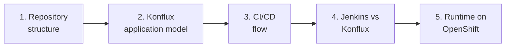

# Konflux Visual Learning Guide

This guide ties together architecture diagrams for the **brewspace** application in the [dno-automation-services](https://github.com/tomswallaRH/dno-automation-services) repository. Each diagram is Mermaid-based, with sections on Konflux UI and Tekton mapping.

Use this document as a reading order for onboarding; deeper prose lives in `applications/brewspace/konflux-learning-guide.md` and `applications/brewspace/architecture.md`.

**Hands-on labs:** [docs/learning-labs/](learning-labs/README.md) — seven labs for Jenkins engineers (Application → Release).

---

## Learning path

| Step | Topic | What you learn |
|------|--------|----------------|
| 1 | [Repository structure](diagrams/01-repository-structure.md) | Where api, frontend, integration, deploy, and `.tekton` live |
| 2 | [Konflux application model](diagrams/02-konflux-application-model.md) | Application → Components → Snapshot → Integration tests |
| 3 | [CI/CD flow](diagrams/03-cicd-flow.md) | Git push through build, test, promotion, deploy |
| 4 | [Jenkins vs Konflux](diagrams/04-jenkins-vs-konflux.md) | Why component-based Tekton differs from monolithic Jenkins |
| 5 | [Runtime architecture](diagrams/05-runtime-architecture.md) | Routes, Services, Pods, and image digests on cluster |

---

## Diagram index

### 1. Repository Structure Diagram

**File:** [docs/diagrams/01-repository-structure.md](diagrams/01-repository-structure.md)

Maps the physical layout of `applications/brewspace`: components, integration tests, deploy manifests, and root `.tekton` PaC templates.

**Key repo paths:**

- `applications/brewspace/components/api/` — Flask API
- `applications/brewspace/components/frontend/` — NGINX + static UI
- `applications/brewspace/integration/` — `IntegrationTestScenario` examples
- `applications/brewspace/deploy/openshift/` — OpenShift runtime
- `.tekton/brewspace-*-{push,pull-request}.yaml` — build triggers

---

### 2. Konflux Application Model Diagram

**File:** [docs/diagrams/02-konflux-application-model.md](diagrams/02-konflux-application-model.md)

Shows how Konflux CRs relate: **Application** `brewspace`, **Components** `brewspace-api` and `brewspace-frontend`, build **PipelineRuns**, **Snapshot**, and **IntegrationTestScenario** resources.

**Manifests to read:**

- `applications/brewspace/components/*/component.yaml`
- `applications/brewspace/integration/verify-api.yaml`
- `applications/brewspace/integration/verify-frontend.yaml`

---

### 3. CI/CD Flow Diagram

**File:** [docs/diagrams/03-cicd-flow.md](diagrams/03-cicd-flow.md)

End-to-end sequence: developer commit → PaC → per-component build → Quay → Snapshot → integration → policy → promotion → `oc apply` deploy.

**Hands-on tip:** After a green build, take `IMAGE_DIGEST` from the Pipeline run and set it in Kustomize per `applications/brewspace/README.md`.

---

### 4. Jenkins vs Konflux Comparison Diagram

**File:** [docs/diagrams/04-jenkins-vs-konflux.md](diagrams/04-jenkins-vs-konflux.md)

Side-by-side mental model: one Jenkins pipeline with stages vs multiple Konflux Components, Snapshots, and declarative integration tests.

---

### 5. Runtime Architecture Diagram

**File:** [docs/diagrams/05-runtime-architecture.md](diagrams/05-runtime-architecture.md)

How traffic flows: browser → Route → frontend Service/Pod → NGINX proxy → api Service/Pod; images from Quay digests.

---

## Quick reference: Konflux UI ↔ repo ↔ Tekton

| You see in Konflux UI | In this repo | Tekton / K8s object |
|----------------------|--------------|---------------------|
| Application brewspace | App onboarding + labels on PaC | `Application` |
| Component brewspace-api | `components/api/component.yaml` | `Component` + build `PipelineRun` |
| Pipeline run (build) | `.tekton/brewspace-api-push.yaml` | `PipelineRun`, `TaskRun`s |
| Snapshot | (controller-assembled) | `Snapshot` |
| Integration test | `integration/verify-api.yaml` | `IntegrationTestScenario` + `PipelineRun` |
| (not in Konflux UI) | `deploy/openshift/*.yaml` | `Deployment`, `Service`, `Route` |

---

## Related documentation in the repo

| Document | Purpose |
|----------|---------|
| [applications/brewspace/README.md](../applications/brewspace/README.md) | Layout, OpenShift deploy steps |
| [applications/brewspace/konflux-learning-guide.md](../applications/brewspace/konflux-learning-guide.md) | Concept definitions (build, snapshot, workflow) |
| [applications/brewspace/architecture.md](../applications/brewspace/architecture.md) | Service and CI/CD narrative |
| [applications/brewspace/pipelines/brewspace-pipeline.yaml](../applications/brewspace/pipelines/brewspace-pipeline.yaml) | Educational multi-task Tekton Pipeline |
| [README.md](../README.md) | Repository root overview |

---

## Viewing Mermaid diagrams

- **GitHub / GitLab:** Mermaid in markdown renders in the file preview.
- **VS Code / Cursor:** Markdown preview with Mermaid support.
- **konflux.dev docs:** Same mental model applies to managed Konflux tenants; namespace and Quay paths in PaC files use `sfathii-tenant` as in `.tekton/brewspace-api-push.yaml`.

---

## Suggested exercises

1. Trace a change to `components/api/src/app.py` through diagram 3: which PaC file fires, which PipelineRun name, which path filter?
2. Open diagram 2 and list what lands in a Snapshot when both component builds succeed.
3. Deploy using diagram 5: apply `deploy/openshift`, hit Route `brewspace-frontend`, confirm UI shows API health via `/health` proxy.
4. Compare diagram 4 with a Jenkins pipeline you know: where would Snapshot and digest promotion appear in Jenkins?
