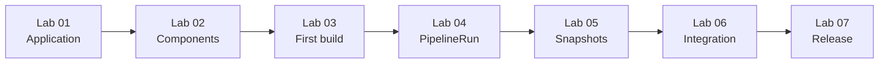

# Brewspace Konflux Learning Labs

Hands-on labs for **Jenkins engineers** learning to think in **Konflux terms**: Applications, Components, immutable digests, Snapshots, and policy-gated promotion—not monolithic jobs and mutable artifacts.

## Who this is for

You are comfortable with Jenkins multibranch pipelines, stages, and shared libraries. These labs reframe the same problems using Konflux + Tekton + Git-as-source-of-truth.

## Before you start

| Requirement | Notes |
|-------------|--------|
| Konflux / Red Hat Developer Hub access | Tenant namespace (e.g. `sfathii-tenant` in this repo’s PaC files) |
| OpenShift CLI (`oc`) | Logged in to the cluster where Konflux runs |
| Git access | Fork or branch on `dno-automation-services` |
| Read once | [Konflux Visual Guide](../konflux-visual-guide.md), `applications/brewspace/README.md` |

Replace `<tenant>`, `<namespace>`, and Git URLs with your environment values.

## Lab roadmap

| Lab | Topic | Jenkins mental model you leave behind |
|-----|--------|-------------------------------------|
| [01 - Create Application](lab-01-create-application.md) | Application CR | “Folder + job naming” |
| [02 - Create Components](lab-02-create-components.md) | API + frontend Components | “Stages in one Jenkinsfile” |
| [03 - Trigger First Build](lab-03-trigger-first-build.md) | PaC + PipelineRun | “Build #47 on push” |
| [04 - Investigate PipelineRun](lab-04-investigate-pipelinerun.md) | TaskRuns + image | “Stage logs only” |
| [05 - Understand Snapshots](lab-05-understand-snapshots.md) | Snapshot CR | “Last green archive” |
| [06 - Integration Tests](lab-06-integration-tests.md) | IntegrationTestScenario | “Downstream test job” |
| [07 - Release and Promotion](lab-07-release-and-promotion.md) | Release / GitOps | “Deploy stage” |

## Time estimate

| Lab | Duration (guided) |
|-----|-------------------|
| 01 | 30–45 min |
| 02 | 45–60 min |
| 03 | 30 min (+ build wait) |
| 04 | 60–90 min |
| 05 | 45 min |
| 06 | 60 min |
| 07 | 45–60 min (concept-heavy) |

**Total:** ~6–8 hours spread over several days (build and integration waits add wall-clock time).

## Completion checklist

- [ ] Application `brewspace` visible in Konflux UI
- [ ] Components `brewspace-api` and `brewspace-frontend` configured with correct source context
- [ ] At least one successful push PipelineRun per component
- [ ] You can list TaskRuns and explain `IMAGE_DIGEST`
- [ ] You have observed a Snapshot with both component digests
- [ ] Integration scenarios `brewspace-verify-api` and `brewspace-verify-frontend` understood (pass or fail analyzed)
- [ ] You can describe promotion vs `deploy/openshift/` apply

## Related docs

- [docs/konflux-visual-guide.md](../konflux-visual-guide.md)
- [docs/diagrams/](../diagrams/)
- [applications/brewspace/konflux-learning-guide.md](../../applications/brewspace/konflux-learning-guide.md)
