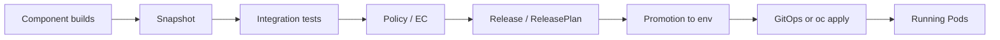

# Lab 07 — Release and Promotion

## Objective

Explain Konflux **release flow**, how **environments** fit in, and how **GitOps** relates to brewspace—so you can describe the path from a tested Snapshot to running Pods without equating it to a Jenkins `deploy` stage.

## Prerequisites

- Labs 01–06 complete (conceptually; Lab 06 integration understanding required).
- Read `applications/brewspace/deploy/openshift/` and [CI/CD flow diagram](../diagrams/03-cicd-flow.md).
- Optional: cluster namespace where `oc auth can-i create deployments.apps` is `yes`.

## Jenkins → Konflux framing

| Jenkins deploy stage | Konflux + GitOps (brewspace learning path) |
|----------------------|--------------------------------------------|
| `ssh deploy.sh $HOST` | Promote **digest**; separate cluster apply |
| `kubectl set image ... :latest` | `kustomize edit set image ...@sha256:...` |
| “Deploy what we built” | Deploy what **Snapshot** proved |
| Environment = job parameter | Environment = namespace + ReleasePlan / GitOps branch |
| Pipeline ends in prod | Pipeline ends in **promotable Snapshot**; GitOps syncs runtime |

---

## Explain release flow

### End-to-end (conceptual)



| Stage | What happens | brewspace note |
|-------|----------------|----------------|
| Build | PipelineRuns publish digests | Per-component PaC |
| Snapshot | Freeze api + frontend digests | Lab 05 |
| Test | Integration scenarios | `verify-api`, `verify-frontend` |
| Policy | Enterprise Contract, CVE gates | docker-build scan tasks |
| Release | Planned promotion object | May be configured by platform team |
| Deploy | Cluster pulls digest | `deploy/openshift/` in this repo |

**Key idea:** Konflux separates **proving** (build + snapshot + test + policy) from **placing** (promotion / GitOps / manual apply).

---

## Explain environments

Environments are not folders in Jenkins—they are **targets** with rules about which Snapshots may enter.

| Environment (example) | Typical namespace | How brewspace might land |
|----------------------|-------------------|---------------------------|
| **Development** | `dev-brewspace` | Manual `oc apply -k` with digests from last green Snapshot |
| **Staging** | `stage-brewspace` | GitOps PR updating image digests in overlay |
| **Production** | `prod-brewspace` | ReleasePlan admission + automated promotion |

Konflux objects (names vary by install):

| CR | Role |
|----|------|
| `ReleasePlan` | Defines what may be released from an application |
| `ReleasePlanAdmission` | Binds plan to environment/namespace |
| `Release` | Executes promotion for a Snapshot |
| `SnapshotEnvironmentBinding` | Associates snapshot with environment for deployment |

**This learning repo** does not ship production ReleasePlans; your mentor/platform team adds them. Your hands-on deploy path is documented in `applications/brewspace/README.md`.

---

## Explain GitOps relationship

### Three layers (do not conflate)

| Layer | Location | Owner |
|-------|----------|-------|
| **Build intent** | `.tekton/`, `component.yaml` | Konflux / developers |
| **Deploy intent** | `applications/brewspace/deploy/openshift/` | Platform / developers |
| **Runtime state** | OpenShift cluster | GitOps controller or `oc` |

### GitOps pattern with brewspace

1. Konflux produces digests → Snapshot passes tests.
2. You open a PR to your **deployment repo** (or same repo) updating Kustomize:

```bash
cd applications/brewspace/deploy/openshift
kustomize edit set image brewspace-api=quay.io/redhat-user-workloads/<tenant>/brewspace-api@sha256:<api-digest>
kustomize edit set image brewspace-frontend=quay.io/redhat-user-workloads/<tenant>/brewspace-frontend@sha256:<fe-digest>
```

3. Argo CD / OpenShift GitOps syncs `Deployment` + `Service` + `Route`.
4. Frontend Route serves UI; NGINX proxies `/health` to `brewspace-api` Service.

**Jenkins engineer mindset shift:** The pipeline does not need SSH to prod. Promotion updates **desired state in Git** (or release controller does), cluster reconciles.

### What stays outside Konflux UI

- `Deployment`, `Service`, `Route` in `deploy/openshift/`
- Network policies, quotas, SSO routes

Konflux UI shows **what may be deployed** (digest); OpenShift console shows **what is running**.

---

## Step-by-step instructions

### 1. Trace promotion inputs

From your latest passing Snapshot, record:

- API `sha256:...`
- Frontend `sha256:...`
- Integration test status (both green)

### 2. Simulate “dev promotion” (manual GitOps)

```bash
cd applications/brewspace/deploy/openshift
# Set real digests from Lab 04/05
kustomize edit set image brewspace-api=<full image@sha256>
kustomize edit set image brewspace-frontend=<full image@sha256>
oc apply -k . -n <dev-namespace>
oc get route brewspace-frontend -n <dev-namespace>
```

Open Route URL; confirm **API Status: OK**.

### 3. Simulate GitOps PR (desk exercise)

Draft PR description:

- **What:** Bump brewspace images to Snapshot `<id>` digests
- **Why:** Snapshot passed integration + policy
- **Rollback:** Revert PR to previous digests

### 4. Discuss Release CR flow (with mentor)

Ask your admin to show (read-only):

```bash
oc get releaseplan,release,releaseplanadmission -n <tenant-or-env-ns>
```

Map UI **Release** button (if present) to these CRs.

### 5. Document tenant vs workload namespace

| Namespace type | Holds | brewspace example |
|----------------|-------|-------------------|
| Tenant (`sfathii-tenant`) | Application, Component, build PipelineRuns | Konflux CI |
| Workload (`dev-...`) | Deployments, Routes | Running app |

---

## Expected Konflux UI view

| UI area | What you might see |
|---------|-------------------|
| Snapshot | **Promotable** or policy badges |
| Release / Releases | Planned or completed release (if enabled) |
| Environment | Staging/prod links (if configured) |
| Component | Digest ready to copy into Git |

### Expected UI screenshots

| # | Filename | Capture |
|---|----------|---------|
| 1 | `19-snapshot-promotable.png` | Snapshot with tests + policy green |
| 2 | `20-release-plan.png` | ReleasePlan (if available in your tenant) |
| 3 | `21-openshift-route.png` | OpenShift route after deploy (runtime) |

---

## Expected Tekton resources

| Phase | Tekton / K8s |
|-------|----------------|
| Build | `PipelineRun` type `build` (Labs 03–04) |
| Integration | `PipelineRun` from Integration Service (Lab 06) |
| Release | May spawn promotion pipelines (platform-specific) |
| Deploy | **No Tekton required**—`Deployment` controller pulls image |

```bash
# Runtime (workload namespace)
oc get deploy,svc,route -n <dev-namespace> -l app.kubernetes.io/part-of=brewspace
```

---

## Troubleshooting

| Symptom | Likely cause | Action |
|---------|--------------|--------|
| Cannot promote in UI | ReleasePlan not configured | Use manual digest deploy for learning |
| GitOps sync fail | Image pull secret missing | Link namespace to Quay workload grant |
| UI OK, browser fail | API not in same namespace | Deploy both manifests |
| Wrong image running | Tag moved, deployment not updated | Use digest in Deployment spec |
| Tenant namespace deploy denied | Policy | Use dev namespace per README |

---

## Quiz questions

1. **Short answer:** What is the difference between **promotion** and **`oc apply -k`** in brewspace?

2. Name two Konflux CRs associated with enterprise release planning.

3. **Scenario:** Snapshot passed tests. Who updates `deploy/openshift/kustomization.yaml` in a GitOps model?

4. **True/false:** Konflux Application `brewspace` automatically creates Routes in your dev namespace.  
   **Answer:** False

5. **Compare:** Jenkins `deploy` stage SSH vs GitOps reconcile loop—list one advantage of GitOps.

6. **Reflection:** Draw your org’s path from Konflux tenant to production namespace (boxes and arrows).

7. **Capstone:** Explain to a Jenkins peer in five sentences how brewspace goes from `git push` to user hitting the frontend Route.

---

## Graduation checklist

You think like a Konflux engineer when you:

- [ ] Say **Component** and **PipelineRun**, not “the brewspace job”
- [ ] Quote **digest**, not **latest**, for deploy decisions
- [ ] Point to **Snapshot** as “what we tested”
- [ ] Separate **integration** PipelineRuns from **build** PipelineRuns
- [ ] Place runtime changes in **Git** (`deploy/openshift/`) or GitOps, not in the build pipeline

---

## Continue learning

- [Konflux Visual Guide](../konflux-visual-guide.md)
- [docs/diagrams/](../diagrams/)
- Official: [konflux-ci.dev](https://konflux-ci.dev)
