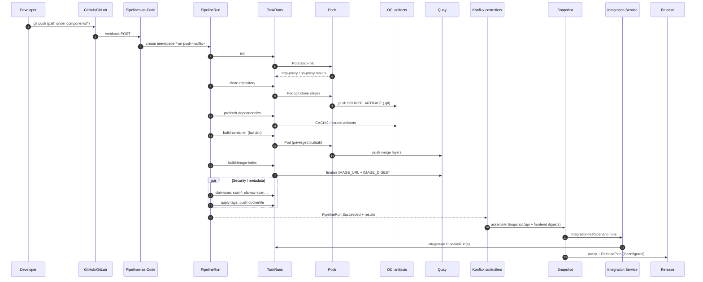
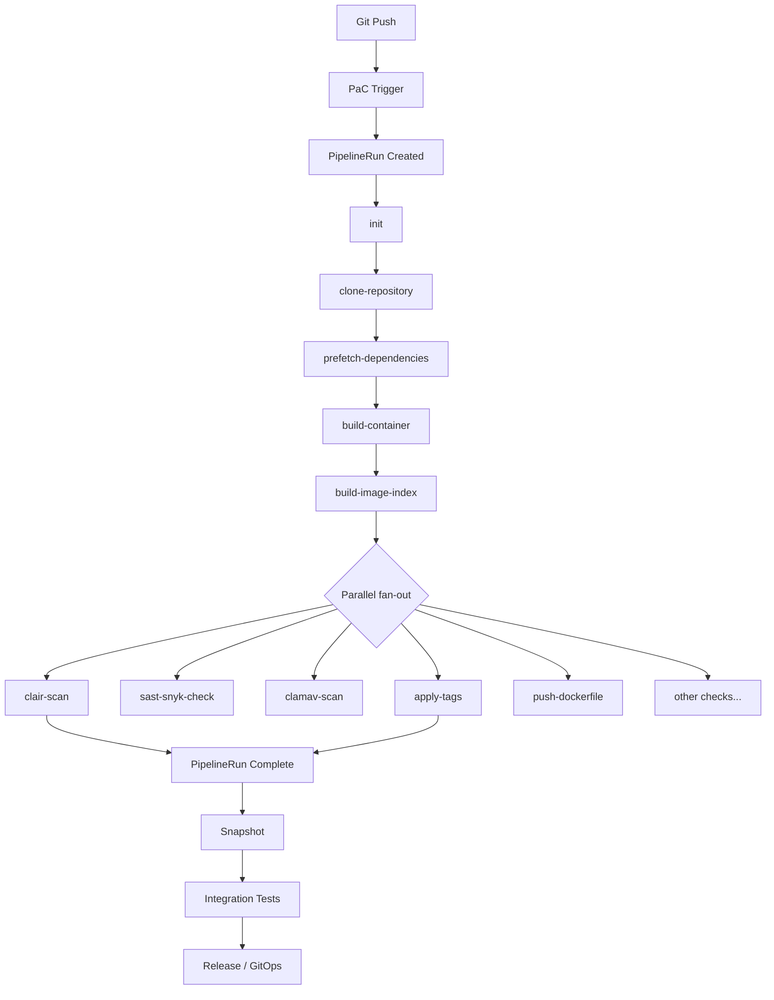

# Lab 08 — Deep Dive: Build Execution After Git Push

**Application:** `brewspace`  
**Components:** `brewspace-api`, `brewspace-frontend`  
**Pipeline:** Konflux `docker-build` (OCI trusted artifacts) — embedded in `.tekton/brewspace-*-push.yaml`  
**Tenant namespace (this repo):** `sfathii-tenant`

**Your live observation:** `init` **Succeeded**, `clone-repository` **Running** on `brewspace-api-on-push-*` / `brewspace-frontend-on-push-*`.

**Goal:** Debug and reason about Konflux builds from the cluster (Git → PipelineRun → TaskRun → Pod → image → Snapshot) **without relying on the UI**.

---

## Prerequisites

- Labs [03](lab-03-trigger-first-build.md)–[05](lab-05-understand-snapshots.md) or equivalent experience.
- `oc` access to tenant namespace.
- A live or recent PipelineRun (your examples below).
- Optional: [PipelineRun Pending playbook](../troubleshooting/pipelinerun-pending.md) if runs never leave Pending.

---

## Mermaid: end-to-end sequence



---

## Mermaid: build task flow (docker-build)



---

## Stage reference (every step)

For each stage: **UI** | **Tekton** | **Kubernetes** | **Logs** | **Failures** | **Jenkins**

---

### Stage 0: Git push

| Dimension | Detail |
|-----------|--------|
| **Konflux UI** | Nothing yet; later **Activity** shows commit SHA on PipelineRun. |
| **Tekton** | None. |
| **Kubernetes** | None. |
| **Logs** | Git provider webhook delivery log (outside cluster). |
| **Common failures** | Push to wrong branch; path filter no match; webhook disabled. |
| **Jenkins** | SCM poll / webhook → job queued. **Diff:** Konflux only builds if PaC CEL + path rules match. |

**brewspace path filter (api push):** `applications/brewspace/components/api/***` or Containerfile or `.tekton/brewspace-api-push.yaml` on `main`.

```bash
git log -1 --oneline
git show --name-only HEAD
```

---

### Stage 1: Pipelines-as-Code trigger

| Dimension | Detail |
|-----------|--------|
| **Konflux UI** | New **Pipeline run** appears under **brewspace-api** or **brewspace-frontend** (seconds after push). |
| **Tekton** | PaC creates `PipelineRun` with rendered params (`{{revision}}`, `{{source_url}}`, `{{ git_auth_secret }}`). |
| **Kubernetes** | `PipelineRun` object in tenant NS; labels `appstudio.openshift.io/application=brewspace`, `component=brewspace-api`, `pipelines.appstudio.openshift.io/type=build`. |
| **Logs** | PaC controller logs (platform): `oc logs -n openshift-pipelines deployment/pipelines-as-code-controller --tail=50` |
| **Common failures** | Repository CR not linked to fork; template render error; max runs / concurrency. |
| **Jenkins** | Multibranch indexing creates run. **Diff:** Run is a **Kubernetes CR**, not controller queue entry. |

```bash
export NS=sfathii-tenant
oc get pipelinerun -n $NS -l appstudio.openshift.io/component=brewspace-api \
  --sort-by=.metadata.creationTimestamp | tail -5
```

---

### Stage 2: PipelineRun creation

| Dimension | Detail |
|-----------|--------|
| **Konflux UI** | Run name `brewspace-api-on-push-<suffix>`; status **Running** or **Pending**. |
| **Tekton** | `PipelineRun` with inline `pipelineSpec` (docker-build-oci-ta shape). |
| **Kubernetes** | Same `PipelineRun`; `taskRunTemplate.serviceAccountName: build-pipeline-brewspace-api`. |
| **Logs** | `oc describe pipelinerun <pr> -n $NS` → Conditions, Events. |
| **Common failures** | `PipelineRunPending` — see [pending playbook](../troubleshooting/pipelinerun-pending.md). |
| **Jenkins** | Build #N created. **Diff:** Spec is full DAG of Tekton tasks from Git template. |

**Key params (api):**

| Param | Example value |
|-------|-----------------|
| `git-url` | Your repo URL |
| `revision` | Commit SHA |
| `output-image` | `quay.io/redhat-user-workloads/sfathii-tenant/brewspace-api:<sha>` |
| `dockerfile` | `applications/brewspace/components/api/Containerfile` |
| `path-context` | `applications/brewspace/components/api` |

```bash
export PR=brewspace-api-on-push-cj76v
oc get pipelinerun $PR -n $NS -o yaml | grep -A2 'output-image\|revision\|dockerfile'
```

---

### Stage 3: TaskRun — `init`

| Dimension | Detail |
|-----------|--------|
| **Konflux UI** | Task graph: **init** green (Succeeded). |
| **Tekton** | `TaskRun` `<pr>-init-*`; bundle `task-init:0.4`. |
| **Kubernetes** | `Pod` with label `tekton.dev/taskRun=<tr-name>`; container `step-*`. |
| **Logs** | `oc logs <pod> -n $NS -c step-<name>` or `oc logs $(oc get tr ...-init-...) -n $NS --all-containers` |
| **Common failures** | Pod unschedulable; bundle image pull; SCC denial. |
| **Jenkins** | Agent label / env prep. **Diff:** Tiny Pod, not executor allocation. |

**Produces:** `http-proxy`, `no-proxy` results consumed by `build-container`.

```bash
oc get taskrun -n $NS -l tekton.dev/pipelineRun=$PR | grep init
TR_INIT=$(oc get taskrun -n $NS -l tekton.dev/pipelineRun=$PR -o name | grep '\-init\-' | head -1)
oc describe $TR_INIT -n $NS
```

---

### Stage 4: TaskRun — `clone-repository`

| Dimension | Detail |
|-----------|--------|
| **Konflux UI** | **clone-repository** blue/spinner (**Running**) — your current state. |
| **Tekton** | `TaskRun` `git-clone-oci-ta`; `runAfter: init`; workspace `git-auth`. |
| **Kubernetes** | Pod mounting secrets for `basic-auth` workspace; clone steps. |
| **Logs** | Step logs: clone URL, fetch, commit checkout. |
| **Common failures** | 401/403 Git auth; wrong `revision`; network to Git; secret `{{ git_auth_secret }}` missing. |
| **Jenkins** | `checkout scm`. **Diff:** Output is **OCI artifact** (`SOURCE_ARTIFACT`, `.git` ociStorage), not workspace folder. |

**Produces:** `SOURCE_ARTIFACT`, `commit`, `url` → fed to prefetch + build.

```bash
TR_CLONE=$(oc get taskrun -n $NS -l tekton.dev/pipelineRun=$PR -o name | grep clone-repository | head -1)
oc describe $TR_CLONE -n $NS
POD=$(oc get pod -n $NS -l tekton.dev/taskRun=$(basename $TR_CLONE) -o name)
oc logs $POD -n $NS --all-containers --tail=80
```

**While Running:** Pod phase `Running`, active step `step-git-clone` or similar.

---

### Stage 5: TaskRun — `prefetch-dependencies`

| Dimension | Detail |
|-----------|--------|
| **Konflux UI** | **prefetch-dependencies** after clone completes. |
| **Tekton** | `prefetch-dependencies-oci-ta`; inputs `SOURCE_ARTIFACT` from clone. |
| **Kubernetes** | Pod; may use `netrc` workspace for registries. |
| **Logs** | pip/cachi2 prefetch for Python (`requirements.txt` in api). |
| **Common failures** | PyPI/proxy blocked; bad requirements; hermetic prefetch mismatch. |
| **Jenkins** | `pip install` / cache dir stage. **Diff:** Outputs `CACHI2_ARTIFACT` OCI blob for buildah. |

```bash
# After clone succeeds
oc get taskrun -n $NS -l tekton.dev/pipelineRun=$PR | grep prefetch
```

---

### Stage 6: TaskRun — `build-container`

| Dimension | Detail |
|-----------|--------|
| **Konflux UI** | Longest task; **build-container** Running several minutes. |
| **Tekton** | `buildah-oci-ta`; Dockerfile = `Containerfile`, context = component path. |
| **Kubernetes** | Pod often needs **privileged** / BUILD capabilities; high CPU/mem. |
| **Logs** | Buildah layer steps, `pip install`, push layers to registry. |
| **Common failures** | Containerfile error; base image pull; Quay push 403; OOMKilled. |
| **Jenkins** | `docker.build()` / `buildah bud`. **Diff:** No local daemon on agent—Pod IS the builder. |

**SBOM note:** This repo’s PaC YAML has no separate task named `sbom`. In Konflux **docker-build-oci-ta**, SBOM/provenance metadata is typically produced **inside** the buildah / build pipeline (syft, Chains attestation hooks) and consumed by Enterprise Contract—not a separate row in the UI task list. If your UI shows an SBOM-related step, it may be bundled inside **build-container** or a catalog variant. Treat “SBOM generation” as **part of image build + attestations**, finalized before scans use `IMAGE_DIGEST`.

```bash
TR_BUILD=$(oc get taskrun -n $NS -l tekton.dev/pipelineRun=$PR -o name | grep build-container | head -1)
oc logs $TR_BUILD -n $NS -c step-build --tail=100
oc logs $TR_BUILD -n $NS -c step-generate-sbom --tail=50 2>/dev/null || true
```

---

### Stage 7: TaskRun — `build-image-index` (push to Quay)

| Dimension | Detail |
|-----------|--------|
| **Konflux UI** | **build-image-index**; then PipelineRun **results** show digest. |
| **Tekton** | `build-image-index`; aggregates image from `build-container`. |
| **Kubernetes** | Pod; pushes manifest/index to Quay. |
| **Logs** | Push destination, digest output. |
| **Common failures** | Registry auth on SA; wrong `output-image` path; manifest errors. |
| **Jenkins** | `docker push`. **Diff:** Authoritative outputs `IMAGE_URL` + `IMAGE_DIGEST` on **PipelineRun**. |

This is the **“push image to Quay”** milestone for practical debugging.

```bash
oc get pipelinerun $PR -n $NS -o jsonpath='{range .status.results[*]}{.name}={.value}{"\n"}{end}'
```

---

### Stage 8: TaskRuns — image scan & compliance (parallel)

| Dimension | Detail |
|-----------|--------|
| **Konflux UI** | Fan-out: **clair-scan**, **clamav-scan**, **sast-snyk-check**, **sast-shell-check**, **sast-unicode-check**, **deprecated-base-image-check**, **ecosystem-cert-preflight-checks**, **rpms-signature-scan** (when `skip-checks=false`). |
| **Tekton** | Multiple `TaskRun`s, all `runAfter: build-image-index`. |
| **Kubernetes** | Many Pods in parallel → quota pressure. |
| **Logs** | Per-scan task; CVE lists, policy violations. |
| **Common failures** | CVE policy fail; Clair unreachable; false positive waivers needed. |
| **Jenkins** | Parallel stages SonarQube/Clair. **Diff:** Each scan is its own Pod/TaskRun, not shared workspace. |

**“Image scan” in brewspace = primarily `clair-scan` + SAST tasks**, not one generic stage.

```bash
oc get taskrun -n $NS -l tekton.dev/pipelineRun=$PR \
  -o custom-columns=TASK:.metadata.labels.'tekton\.dev/pipelineTask',STATUS:.status.conditions[0].reason
```

---

### Stage 9: TaskRuns — `apply-tags`, `push-dockerfile`

| Dimension | Detail |
|-----------|--------|
| **Konflux UI** | Near end of DAG; metadata tagging. |
| **Tekton** | `apply-tags`, `push-dockerfile-oci-ta`. |
| **Kubernetes** | Short-lived Pods. |
| **Logs** | Tag application; Dockerfile blob push. |
| **Common failures** | Tag permission; metadata registry errors. |
| **Jenkins** | Archive Dockerfile / retag. **Diff:** Tied to digest for supply chain. |

---

### Stage 10: PipelineRun complete

| Dimension | Detail |
|-----------|--------|
| **Konflux UI** | Pipeline run **Succeeded** (or **Failed** if any critical task failed). |
| **Tekton** | `PipelineRun` condition `Succeeded=True`; child TaskRuns terminal. |
| **Kubernetes** | Pods may remain **Completed** until GC. |
| **Logs** | `oc describe pipelinerun $PR` summary. |
| **Common failures** | One failed scan fails entire run (policy dependent). |
| **Jenkins** | Build result UNSTABLE vs FAILURE. **Diff:** Tekton failure is per-task; Konflux may still show digest if push happened before scan fail. |

---

### Stage 11: Snapshot creation

| Dimension | Detail |
|-----------|--------|
| **Konflux UI** | **Application brewspace** → **Snapshots** new row (both components’ digests when both builds done). |
| **Tekton** | None directly—Konflux controllers watch build status. |
| **Kubernetes** | `Snapshot` CR (`appstudio.redhat.com` / `appstudio` API group per version). |
| **Logs** | Controller logs (platform); `oc describe snapshot`. |
| **Common failures** | Only one component built; build Failed; controller lag. |
| **Jenkins** | “Last green” + copied artifacts. **Diff:** Immutable multi-image record. |

```bash
oc get snapshot -n $NS
oc get snapshot -n $NS -o yaml | grep -E 'brewspace-api|brewspace-frontend|sha256'
```

---

### Stage 12: Integration tests

| Dimension | Detail |
|-----------|--------|
| **Konflux UI** | **Integration tests** → `brewspace-verify-api`, `brewspace-verify-frontend` on Snapshot. |
| **Tekton** | **Separate** `PipelineRun`s (not `brewspace-api-on-push-*`). |
| **Kubernetes** | Test Pods; may deploy ephemeral workloads. |
| **Logs** | Integration PipelineRun task logs. |
| **Common failures** | Wrong resolver URL; API health not ok; frontend text mismatch. |
| **Jenkins** | Downstream test job. **Diff:** Input is **Snapshot digests**, not workspace. |

See [Lab 06](lab-06-integration-tests.md).

---

### Stage 13: Release

| Dimension | Detail |
|-----------|--------|
| **Konflux UI** | **Releases** / promotable Snapshot (if ReleasePlan configured). |
| **Tekton** | Optional promotion pipelines (environment-specific). |
| **Kubernetes** | `Release`, `ReleasePlan`, `ReleasePlanAdmission`; deploy in workload NS. |
| **Logs** | Release controller; GitOps sync logs. |
| **Common failures** | Policy not passed; no ReleasePlan; manual deploy only. |
| **Jenkins** | Deploy stage SSH. **Diff:** GitOps updates digest in `deploy/openshift/`. |

See [Lab 07](lab-07-release-and-promotion.md).

---

## Konflux UI screenshots to capture

Save under `docs/learning-labs/screenshots/lab-08/`:

| # | Filename | When to capture |
|---|----------|-----------------|
| 1 | `08-activity-pipelinerun-list.png` | Application brewspace Activity |
| 2 | `08-task-graph-init-clone.png` | init Succeeded + clone Running (your state) |
| 3 | `08-clone-task-logs.png` | clone-repository log view |
| 4 | `08-build-container-running.png` | build-container in progress |
| 5 | `08-parallel-scans.png` | Fan-out after build-image-index |
| 6 | `08-results-digest.png` | IMAGE_DIGEST on succeeded run |
| 7 | `08-snapshot-two-components.png` | Snapshot with api + frontend digests |
| 8 | `08-integration-on-snapshot.png` | Integration test status |

---

## Tekton & Kubernetes resources (master table)

| Phase | Tekton | Kubernetes (typical) |
|-------|--------|----------------------|
| PaC trigger | — | `PipelineRun` |
| Each task | `TaskRun` | `Pod`, sometimes `Secret` volume |
| Git clone | `TaskRun` clone-repository | Pod + `Secret` (git-auth) |
| Build | `TaskRun` build-container | Privileged Pod |
| Push | `TaskRun` build-image-index | Pod |
| Scans | Many `TaskRun`s | Many Pods |
| Complete | `PipelineRun` status | Completed Pods (GC later) |
| Snapshot | — | `Snapshot` CR |
| Integration | `PipelineRun` (other name) | Test Pods |
| Release | Optional `PipelineRun` | `Release*` CRs |

**Naming pattern:**

```
PipelineRun:  brewspace-api-on-push-cj76v
TaskRun:      brewspace-api-on-push-cj76v-clone-repository-1
Pod:          brewspace-api-on-push-cj76v-clone-repository-1-pod
```

---

## Example `oc` command toolkit

```bash
export NS=sfathii-tenant
export PR=brewspace-api-on-push-cj76v

# --- PipelineRun ---
oc get pipelinerun $PR -n $NS
oc describe pipelinerun $PR -n $NS
oc get pipelinerun $PR -n $NS -o jsonpath='{range .status.conditions[*]}{.type} {.status} {.reason}: {.message}{"\n"}{end}'

# --- All TaskRuns for this build ---
oc get taskrun -n $NS -l tekton.dev/pipelineRun=$PR \
  -o custom-columns=NAME:.metadata.name,TASK:.metadata.labels.tekton\.dev/pipelineTask,STATUS:.status.conditions[0].reason,START:.status.startTime

# --- One task (clone) ---
TR=$(oc get taskrun -n $NS -l tekton.dev/pipelineRun=$PR -o jsonpath='{range .items[?(@.metadata.labels.tekton\.dev/pipelineTask=="clone-repository")]}{.metadata.name}{end}')
oc describe taskrun $TR -n $NS
oc get pod -n $NS -l tekton.dev/taskRun=$TR -o wide

# --- Logs ---
POD=$(oc get pod -n $NS -l tekton.dev/taskRun=$TR -o jsonpath='{.items[0].metadata.name}')
oc logs $POD -n $NS --all-containers --tail=100

# --- Events ---
oc get events -n $NS --field-selector involvedObject.name=$PR --sort-by=.metadata.creationTimestamp
oc get events -n $NS --field-selector involvedObject.name=$POD --sort-by=.metadata.creationTimestamp

# --- Image results (after build-image-index) ---
oc get pipelinerun $PR -n $NS -o jsonpath='{range .status.results[*]}{.name}={.value}{"\n"}{end}'

# --- Watch live ---
oc get taskrun -n $NS -l tekton.dev/pipelineRun=$PR -w
```

---

## Example failure scenarios

| Scenario | Symptom | First log / command | Likely fix |
|----------|---------|---------------------|------------|
| **Stuck on clone Running** | Large repo, slow network | `oc logs` on clone Pod | Wait; or check Git latency / credentials |
| **Clone Failed 401** | TaskRun Failed | clone step log | Fix PaC git secret / fork access |
| **Prefetch Failed** | After clone | prefetch TaskRun log | requirements.txt, proxy |
| **build-container OOM** | Pod OOMKilled | `oc describe pod` | Quota / limits; platform node size |
| **Push 403** | build-image-index Failed | buildah push log | SA image push secret to Quay |
| **clair Failed** | Pipeline Failed late | clair-scan log | CVE waiver or base image bump |
| **api ok, no Snapshot** | Builds differ in time | `oc get snapshot` | Wait for frontend build; both must succeed |
| **Wrong component built** | Unexpected PR name | `oc get pr --show-labels` | Path filter — only changed paths build |

---

## Follow one real build

Trace **your** PipelineRuns from commit to Snapshot using CLI only.

### Builds under investigation

| PipelineRun | Component | Notes |
|-------------|-----------|--------|
| `brewspace-api-on-push-cj76v` | brewspace-api | Example api trace |
| `brewspace-api-on-push-kjfcg` | brewspace-api | Compare two api runs (retries/rebuilds) |
| `brewspace-frontend-on-push-t9w4r` | brewspace-frontend | Frontend parallel pipeline |

### Step A — Git commit → PipelineRun

```bash
export NS=sfathii-tenant
export PR=brewspace-api-on-push-cj76v

# Commit that triggered this run (from annotation)
oc get pipelinerun $PR -n $NS -o jsonpath='{.metadata.annotations.build\.appstudio\.redhat\.com/commit_sha}{"\n"}'
oc get pipelinerun $PR -n $NS -o jsonpath='{.metadata.annotations.build\.appstudio\.openshift\.io/repo}{"\n"}'

# Verify labels = brewspace / brewspace-api / build
oc get pipelinerun $PR -n $NS --show-labels
```

**Check locally:**

```bash
git show <commit_sha> --stat
# Expect paths under applications/brewspace/components/api/
```

**Jenkins:** “which commit is build #128?” → same annotation on PipelineRun.

---

### Step B — PipelineRun → TaskRuns (your current state)

```bash
oc get taskrun -n $NS -l tekton.dev/pipelineRun=$PR \
  -o custom-columns=TASK:.metadata.labels.tekton\.dev/pipelineTask,STATUS:.status.conditions[0].reason,START:.status.startTime
```

**Expected for healthy progress:**

```
TASK                  STATUS      ...
init                  Succeeded
clone-repository      Running     ← you are here
prefetch-dependencies (not started yet)
...
```

**Compare two api runs:**

```bash
for PR in brewspace-api-on-push-cj76v brewspace-api-on-push-kjfcg; do
  echo "==== $PR ===="
  oc get taskrun -n $NS -l tekton.dev/pipelineRun=$PR -o jsonpath='{range .items[*]}{.metadata.labels.tekton\.dev/pipelineTask}{"\t"}{.status.conditions[0].reason}{"\n"}{end}'
done
```

Ask: Did `kjfcg` fail later while `cj76v` succeeded? Different commit SHA?

---

### Step C — TaskRun → Pod → logs (clone-repository)

```bash
TR=$(oc get taskrun -n $NS -l tekton.dev/pipelineRun=$PR \
  -o jsonpath='{range .items[?(@.metadata.labels.tekton\.dev/pipelineTask=="clone-repository")]}{.metadata.name}{end}')
echo "TaskRun: $TR"

oc get pod -n $NS -l tekton.dev/taskRun=$TR -o wide
POD=$(oc get pod -n $NS -l tekton.dev/taskRun=$TR -o jsonpath='{.items[0].metadata.name}')
oc describe pod $POD -n $NS | tail -25
oc logs $POD -n $NS --all-containers -f
```

**Reasoning without UI:**

- Pod **Pending** → scheduling / quota (not Git).
- Pod **Running**, log streaming clone → normal.
- Pod **Error**, exit non-zero → read last 30 log lines.

---

### Step D — Follow through build → image (after clone completes)

Re-run as tasks appear:

```bash
watch -n5 "oc get taskrun -n $NS -l tekton.dev/pipelineRun=$PR -o custom-columns=TASK:.metadata.labels.tekton\.dev/pipelineTask,STATUS:.status.conditions[0].reason"
```

When **build-image-index** is Succeeded:

```bash
oc get pipelinerun $PR -n $NS -o jsonpath='IMAGE_URL={.status.results[?(@.name=="IMAGE_URL")].value}{"\n"}IMAGE_DIGEST={.status.results[?(@.name=="IMAGE_DIGEST")].value}{"\n"}'
```

**Verify in Quay (optional):**

```bash
# digest must match PipelineRun result
echo '<paste IMAGE_DIGEST>'
```

---

### Step E — Frontend build in parallel

```bash
export PR_FE=brewspace-frontend-on-push-t9w4r
oc get taskrun -n $NS -l tekton.dev/pipelineRun=$PR_FE \
  -o custom-columns=TASK:.metadata.labels.tekton\.dev/pipelineTask,STATUS:.status.conditions[0].reason
```

Frontend uses `build-pipeline-brewspace-frontend` SA and context `applications/brewspace/components/frontend`. Snapshot needs **both** digests.

---

### Step F — PipelineRun → Snapshot

After **both** PipelineRuns Succeeded:

```bash
oc get snapshot -n $NS --sort-by=.metadata.creationTimestamp
SNAP=$(oc get snapshot -n $NS -o jsonpath='{.items[-1].metadata.name}')
oc describe snapshot $SNAP -n $NS
```

Correlate:

```bash
API_SHA=$(oc get pipelinerun brewspace-api-on-push-cj76v -n $NS -o jsonpath='{.status.results[?(@.name=="IMAGE_DIGEST")].value}')
FE_SHA=$(oc get pipelinerun brewspace-frontend-on-push-t9w4r -n $NS -o jsonpath='{.status.results[?(@.name=="IMAGE_DIGEST")].value}' 2>/dev/null)
echo "API digest: $API_SHA"
echo "FE digest:  $FE_SHA"
```

Snapshot should reference the same digests (or the pairing expected for that build wave).

---

### Step G — Snapshot → Integration → Release

```bash
oc get integrationtestscenario -n $NS
oc get pipelinerun -n $NS | grep -E 'verify|integration' || true
```

Integration runs are **new** PipelineRuns—not children of `brewspace-api-on-push-cj76v`.

---

## Debug mindset cheat sheet (no UI)

```text
1. What commit?     → PipelineRun annotation commit_sha
2. What component?  → label appstudio.openshift.io/component
3. Which task now?  → TaskRun list by pipelineRun label
4. Why stuck?       → describe Pod + events
5. Image exists?    → PipelineRun results after build-image-index
6. App consistent?  → Snapshot lists both digests
7. Tests passed?    → integration PipelineRuns on Snapshot
```

---

## Jenkins → full pipeline mapping

| Order | Konflux (brewspace docker-build) | Jenkins equivalent |
|-------|----------------------------------|--------------------|
| 1 | Git push + PaC | Webhook |
| 2 | PipelineRun | Build record |
| 3 | init | Agent setup |
| 4 | clone-repository | checkout scm |
| 5 | prefetch-dependencies | Dependency cache |
| 6 | build-container | docker build |
| 7 | (SBOM in buildah/attestation) | SBOM plugin post-build |
| 8 | build-image-index | docker push |
| 9 | clair-scan + sast-* | security stages |
| 10 | apply-tags | tag image |
| 11 | Snapshot | manual “record of what we shipped” |
| 12 | Integration | downstream job |
| 13 | Release | deploy stage / CD |

**Migration mistake:** Watching only Konflux UI spinners. **Expert habit:** `oc get taskrun -w` + `oc logs` on the **currently Running** pipelineTask.

---

## Related labs & docs

- [Lab 04 — Investigate PipelineRun](lab-04-investigate-pipelinerun.md)
- [Lab 05 — Snapshots](lab-05-understand-snapshots.md)
- [PipelineRun Pending](../troubleshooting/pipelinerun-pending.md)
- [CI/CD diagram](../diagrams/03-cicd-flow.md)
- Source of truth: `.tekton/brewspace-api-push.yaml`

---

## Quiz

1. Your clone-repository is **Running**. Which two objects prove work is in progress without the UI?

2. Where is the authoritative **IMAGE_DIGEST** stored when the build finishes?

3. Why are there two api PipelineRuns (`cj76v` and `kjfcg`)? How do you compare them in one command?

4. **True/false:** Integration tests run as child TaskRuns of `brewspace-api-on-push-cj76v`.

5. What TaskRun must succeed before `clair-scan` starts?

---

## Next steps

- Complete trace for `brewspace-frontend-on-push-t9w4r` through digest.
- When both succeed, open [Lab 06](lab-06-integration-tests.md) on the resulting Snapshot.
- Add screenshots to `screenshots/lab-08/` for your portfolio runbook.
