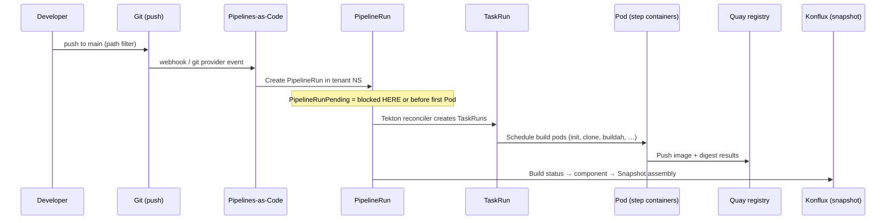

# PipelineRun Pending — Konflux / Tekton Troubleshooting Playbook

**Application:** `brewspace`  
**Components:** `brewspace-api`, `brewspace-frontend`  
**Symptom:** PipelineRuns are created after Git push (e.g. `brewspace-api-on-push-cj76v`, `brewspace-api-on-push-kjfcg`, `brewspace-frontend-on-push-t9w4r`) but remain **`PipelineRunPending`** and never progress to running tasks.

**Audience:** Engineers migrating from Jenkins to Konflux/Tekton on OpenShift.

**Namespace note:** This repo’s PaC templates target tenant namespace `sfathii-tenant`. Replace `<ns>` with your Konflux tenant namespace everywhere below.

---

## Quick reference: stuck PipelineRun — what to check first

Run this **60-second triage** (copy/paste block):

```bash
export NS=sfathii-tenant          # your tenant namespace
export PR=brewspace-api-on-push-cj76v   # your PipelineRun name

# 1) Why is the PipelineRun not running?
oc describe pipelinerun "$PR" -n "$NS" | sed -n '/Conditions:/,/Labels:/p'
oc get pipelinerun "$PR" -n "$NS" -o jsonpath='{range .status.conditions[*]}{.type}={.status} {.reason}{"\n"}{end}'

# 2) Cluster said what?
oc get events -n "$NS" --field-selector involvedObject.name="$PR" \
  --sort-by=.metadata.creationTimestamp | tail -20

# 3) Did Tekton create TaskRuns?
oc get taskrun -n "$NS" -l tekton.dev/pipelineRun="$PR"

# 4) If TaskRuns exist — are Pods stuck?
oc get pods -n "$NS" | grep -E "$(echo $PR | sed 's/on-push/on-push/')"
TR=$(oc get taskrun -n "$NS" -l tekton.dev/pipelineRun="$PR" -o name 2>/dev/null | head -1)
[ -n "$TR" ] && oc describe "$TR" -n "$NS" | sed -n '/Conditions:/,/Events:/p'

# 5) Quota / limits (namespace)
oc get resourcequota,limitrange -n "$NS"
oc describe resourcequota -n "$NS" 2>/dev/null | grep -A5 "Used\|Hard"

# 6) ServiceAccount the pipeline expects (brewspace-api example)
oc get sa build-pipeline-brewspace-api -n "$NS"
oc get sa build-pipeline-brewspace-frontend -n "$NS"
```

**Interpretation in one glance:**

| Observation | Likely layer |
|-------------|----------------|
| No TaskRuns, reason mentions quota / cannot create pod | Namespace **ResourceQuota** / **LimitRange** |
| No TaskRuns, `ServiceAccount` not found | **Missing SA** or Konflux build service not provisioned |
| TaskRuns exist, Pods `Pending` | **Scheduling** / capacity / PVC / image pull |
| TaskRuns `Failed` immediately | **Secrets**, git auth, bundle pull, policy |
| Nothing in events, many PRs pending | **Tekton / PaC controller** or **concurrency** limits |
| Build PR pending forever, integration pending | Wrong doc — see § Integration service (build vs integration) |

---

## 1. How a Konflux build flows internally

Understanding where **Pending** can appear prevents “fixing Git” when the cluster never scheduled a Pod.



### Stage-by-stage (brewspace)

| Step | What happens | Kubernetes / Tekton objects | brewspace specifics |
|------|----------------|------------------------------|---------------------|
| **Git push** | Commit touches `applications/brewspace/components/api/**` or frontend path | — | PaC CEL in `.tekton/brewspace-*-push.yaml` |
| **Pipelines-as-Code** | Matches template, renders `PipelineRun` | `Repository` CR, PaC controller | Labels: `application=brewspace`, `component=brewspace-api` |
| **PipelineRun** | Pipeline spec embedded; waits until Tekton can run | `PipelineRun` `brewspace-api-on-push-*` | `serviceAccountName: build-pipeline-brewspace-api` |
| **TaskRun** | One per task (`init`, `clone-repository`, `build-container`, …) | `TaskRun` | docker-build OCI-TA bundle (often **no PVC** for source) |
| **Pod creation** | TaskRun controller creates Pod with step containers | `Pod` in tenant namespace | Failed scheduling → PipelineRun appears “stuck” |
| **Image build** | Buildah pushes to `quay.io/redhat-user-workloads/<tenant>/brewspace-api:<sha>` | Results: `IMAGE_URL`, `IMAGE_DIGEST` | Lab 04 task list in learning docs |
| **Snapshot** | After builds, Konflux records app-level digests | `Snapshot` CR | **Not** created while PipelineRun is Pending |

**Critical distinction:** `PipelineRunPending` means the **PipelineRun has not successfully started executing the pipeline graph** (or Tekton reports it is still waiting). It is **not** the same as a long-running build (`Running`) or a failed clone (`Failed`).

---

## 2. Every common reason for `PipelineRunPending`

### 2.1 ResourceQuota issues

**Symptom:** Events like `exceeded quota`, `must specify limits`, `pods "..." is forbidden`.

**Why:** Konflux tenant namespaces have hard caps on CPU, memory, Pod count, PVC count, or object counts. Build pipelines spawn **many** Pods (parallel scan tasks after `build-image-index`).

**Check:**

```bash
oc get resourcequota -n <ns>
oc describe resourcequota -n <ns>
oc get pods -n <ns> | wc -l
```

**Fix direction:** Platform team raises quota, reduces `max-keep-runs` / concurrent builds, or cleans old TaskRun Pods.

---

### 2.2 LimitRange issues

**Symptom:** Pod creation denied: `minimum cpu`, `maximum memory`, `Invalid value for limit`.

**Why:** `LimitRange` defaults or max per container conflict with Tekton task resource requests (buildah tasks can be large).

**Check:**

```bash
oc get limitrange -n <ns>
oc describe limitrange -n <ns>
```

Compare with TaskRun pod spec after one is created:

```bash
oc get pod -n <ns> -l tekton.dev/pipelineRun=<pr> -o yaml | grep -A20 resources:
```

---

### 2.3 Missing ServiceAccount

**Symptom:** `serviceaccount "build-pipeline-brewspace-api" not found` or Pod cannot be created.

**Why:** Konflux normally creates `build-pipeline-<component>` when a Component is onboarded. Manual PaC-only setups may lack it.

**brewspace expects:**

| Component | ServiceAccount |
|-----------|----------------|
| brewspace-api | `build-pipeline-brewspace-api` |
| brewspace-frontend | `build-pipeline-brewspace-frontend` |

**Check:**

```bash
oc get sa -n <ns> | grep build-pipeline
oc describe sa build-pipeline-brewspace-api -n <ns>
```

**Fix direction:** Re-onboard Component in Konflux UI, or platform applies build service account + RBAC + image push secrets.

---

### 2.4 Missing Secrets

**Symptom:** PipelineRun stays Pending **or** first TaskRun fails; clone never starts.

**Common secrets:**

| Secret purpose | Used when |
|----------------|-----------|
| Git credentials (`git-auth` workspace) | Private repo clone |
| `netrc` workspace | Registry proxy / prefetch |
| Quay push / `image-controller` linked secrets | Image push (often via SA imagePullSecrets) |

PaC template reference:

```yaml
taskRunTemplate:
  serviceAccountName: build-pipeline-brewspace-api
workspaces:
  - name: git-auth
    secret:
      secretName: '{{ git_auth_secret }}'
```

**Check:**

```bash
oc get secrets -n <ns> | grep -E 'pac|git|quay|docker|registry'
oc get sa build-pipeline-brewspace-api -n <ns> -o yaml | grep -A2 secrets
```

**Note:** Missing secrets often surface as **Failed** TaskRun (`clone-repository`), not Pending—but misconfigured workspace binding can block reconciliation.

---

### 2.5 Missing PVC

**Symptom:** TaskRun waiting for workspace; Pod Pending `unbound PersistentVolumeClaim`.

**brewspace context:** Current docker-build **OCI trusted-artifacts** pipeline in `.tekton/brewspace-api-push.yaml` uses **OCI artifacts between tasks**, not a shared RWO PVC for source. Pending due to PVC is **less common** for this pipeline than for older PVC-based templates.

**Still check** if your cluster patched pipelines or uses custom workspaces:

```bash
oc get pvc -n <ns>
oc get taskrun -n <ns> -l tekton.dev/pipelineRun=<pr> -o yaml | grep -i persistentVolumeClaim
```

---

### 2.6 Unschedulable Pods

**Symptom:** TaskRuns created; Pods `Pending`; events: `0/X nodes available`, `didn't match Pod's node affinity`, `taint`, `Insufficient cpu/memory`.

**Why:** Build workloads need nodes with adequate CPU/RAM; some platforms require specific labels (e.g. `konflux-ci` build node pool).

**Check:**

```bash
oc get pods -n <ns> -l tekton.dev/pipelineRun=<pr>
oc describe pod <pod-name> -n <ns>   # see Events at bottom
oc get nodes
oc describe node <node> | grep -A5 "Allocated resources"
```

---

### 2.7 Node capacity issues

**Symptom:** Cluster-wide Pending pods, `Insufficient memory`, `Too many pods`.

**Why:** Many parallel brewspace builds (api + frontend + scans) plus other tenants.

**Check:**

```bash
oc adm top nodes 2>/dev/null || true
oc get pods -A --field-selector=status.phase=Pending | grep <ns>
```

**Fix direction:** Scale workers, drain stuck builds, lower concurrent PipelineRuns.

---

### 2.8 Tekton controller issues

**Symptom:** Many PipelineRuns Pending; no/new TaskRuns cluster-wide; Tekton operator unhealthy.

**Check (platform / cluster-admin):**

```bash
oc get pods -n openshift-pipelines
oc get pods -n tekton-pipelines   # name varies by install
oc logs -n openshift-pipelines deployment/tekton-pipelines-controller --tail=50
```

**Correlate:**

```bash
oc get pipelinerun -n <ns> --no-headers | awk '{print $2}' | sort | uniq -c
```

If **all** PipelineRuns in namespace are Pending → controller/operator issue. If **only yours** → namespace quota/SA/scheduling.

---

### 2.9 Pipelines-as-Code issues

**Symptom:** PipelineRun object exists (you see it in UI) but spec incomplete, wrong namespace, or not reconciled.

**Causes:**

- PaC cannot resolve `{{ git_auth_secret }}` or other placeholders
- Repository CR not linked to your fork
- CEL matched but template render failed (invalid YAML)
- `cancel-in-progress` / concurrency holding queue

**Check:**

```bash
oc get repository -n <ns> 2>/dev/null
oc describe pipelinerun <pr> -n <ns> | grep -E 'Annotation|Message|Reason'
oc get events -n <ns> | grep -i pipelines-as-code
```

**brewspace:** Verify push hit path filter and target branch `main` in `.tekton/brewspace-api-push.yaml`.

---

### 2.10 Integration service issues

**Important:** Integration PipelineRuns are **not** the same as **build** PipelineRuns.

| Type | Label hint | When Pending is confusing |
|------|------------|---------------------------|
| **Build** | `pipelines.appstudio.openshift.io/type: build` | This playbook — push builds |
| **Integration** | Integration / snapshot labels | Waiting for Snapshot, scenario config, or test cluster |

**Check you are debugging the right run:**

```bash
oc get pipelinerun <pr> -n <ns> --show-labels
oc get pipelinerun -n <ns> -l appstudio.openshift.io/component=brewspace-api
```

If labels show **integration** context, see [Lab 06 — Integration Tests](../learning-labs/lab-06-integration-tests.md). Build Pending with **no TaskRuns** is rarely Integration Service.

---

### 2.11 Additional Tekton-specific Pending causes

| Cause | Signal |
|-------|--------|
| **Affinity assistant** / PVC scheduling | PipelineRun status mentions waiting for PVC or affinity task |
| **Parallelism / finally** misconfiguration | Rare in Konflux bundles |
| **Invalid pipelineSpec** | Message in PipelineRun condition `CouldntGetTask` |
| **Task bundle pull failure** | Cannot resolve `quay.io/konflux-ci/tekton-catalog/...` |
| **Pod security / SCC** | `unable to validate against any security context constraint` |
| **Image pull on step image** | `ErrImagePull` on tekton bundle steps (shows in Pod, not always PipelineRun) |

```bash
oc get pipelinerun <pr> -n <ns> -o yaml | grep -A30 'conditions:'
oc get pipelinerun <pr> -n <ns> -o jsonpath='{.status.reason}{"\n"}{.status.message}{"\n"}'
```

---

## 3. Exact commands to run

Set variables once:

```bash
export NS=sfathii-tenant
export PR=brewspace-api-on-push-cj76v   # change per investigation
```

### PipelineRun

```bash
oc get pipelinerun "$PR" -n "$NS"
oc describe pipelinerun "$PR" -n "$NS"
oc get pipelinerun "$PR" -n "$NS" -o yaml
oc get pipelinerun "$PR" -n "$NS" -o jsonpath='{range .status.conditions[*]}{.type}{"\t"}{.status}{"\t"}{.reason}{"\t"}{.message}{"\n"}{end}'
```

List all stuck brewspace builds:

```bash
oc get pipelinerun -n "$NS" \
  -l appstudio.openshift.io/application=brewspace \
  --sort-by=.metadata.creationTimestamp

oc get pipelinerun -n "$NS" \
  -l appstudio.openshift.io/component=brewspace-api \
  -o custom-columns=NAME:.metadata.name,STATUS:.status.conditions[0].reason,START:.status.startTime
```

### TaskRuns

```bash
oc get taskruns -n "$NS" -l tekton.dev/pipelineRun="$PR"
oc get taskrun -n "$NS" -l tekton.dev/pipelineRun="$PR" \
  -o custom-columns=NAME:.metadata.name,STATUS:.status.conditions[0].reason,START:.status.startTime

oc describe taskrun <taskrun-name> -n "$NS"
oc logs -n "$NS" taskrun/<taskrun-name>/pod -c step-<step-name>  # if pod exists
```

If **zero** TaskRuns → problem is **before** task execution (quota, SA, PipelineRun validation, controller).

### Pods

```bash
oc get pods -n "$NS" | grep "$PR"
oc get pods -n "$NS" -l tekton.dev/pipelineRun="$PR"
oc describe pod <pod-name> -n "$NS"
oc logs <pod-name> -n "$NS" -c step-init --tail=100
```

### Events (most important for Pending)

```bash
oc get events -n "$NS" --sort-by=.metadata.creationTimestamp | tail -40

oc get events -n "$NS" --field-selector involvedObject.name="$PR" \
  --sort-by=.metadata.creationTimestamp

oc get events -n "$NS" --field-selector involvedObject.kind=Pod \
  --sort-by=.metadata.creationTimestamp | tail -30
```

### Quotas and limits

```bash
oc get resourcequota -n "$NS"
oc describe resourcequota -n "$NS"
oc get limitrange -n "$NS"
oc describe limitrange -n "$NS"
```

### PVC / SA / Secrets

```bash
oc get pvc -n "$NS"
oc get sa -n "$NS"
oc get sa build-pipeline-brewspace-api build-pipeline-brewspace-frontend -n "$NS"
oc get secrets -n "$NS"
```

### Component and Application context

```bash
oc get application brewspace -n "$NS"
oc get component brewspace-api brewspace-frontend -n "$NS"
oc describe component brewspace-api -n "$NS"
```

### Optional: PaC / Tekton install health (need cluster read)

```bash
oc get pods -n openshift-pipelines
oc get repository -n "$NS"
```

---

## 4. Decision tree

```
PipelineRun status: Pending (PipelineRunPending)
│
├─► STEP 1: Check PipelineRun Conditions & message
│     oc describe pipelinerun <pr> -n <ns>
│     │
│     ├─ Message mentions Quota / forbidden / limit
│     │     └─► STEP 5: ResourceQuota + LimitRange (§2.1, §2.2)
│     │
│     ├─ Message mentions ServiceAccount / SCC / security
│     │     └─► Missing SA or SCC (§2.3, §2.11)
│     │
│     ├─ Message mentions PipelineValidation / Task not found
│     │     └─► pipelineSpec / bundle resolution (§2.11)
│     │
│     └─ No clear message → STEP 2
│
├─► STEP 2: Check Events (namespace + involvedObject)
│     oc get events -n <ns> --sort-by=...
│     │
│     ├─ "exceeded quota" → STEP 5
│     ├─ "serviceaccount not found" → §2.3
│     ├─ "waiting for PVC" → §2.5
│     └─ no events → STEP 3 + Tekton controller (§2.8)
│
├─► STEP 3: Check TaskRuns
│     oc get taskrun -l tekton.dev/pipelineRun=<pr>
│     │
│     ├─ ZERO TaskRuns
│     │     ├─ Quota / SA / PaC / controller (Steps 1,2,5,§2.9)
│     │     └─ PipelineRun never admitted by Tekton
│     │
│     └─ TaskRuns exist → STEP 4
│
├─► STEP 4: Check Pods for those TaskRuns
│     oc get pods -l tekton.dev/pipelineRun=<pr>
│     oc describe pod <pending-pod>
│     │
│     ├─ Pod Pending: Unschedulable → §2.6, §2.7
│     ├─ Pod Pending: PVC → §2.5
│     ├─ Pod Pending: ImagePullBackOff → registry/bundle access
│     ├─ Pod Running → NOT PipelineRunPending (refresh UI; may be Running)
│     └─ Pod Failed → read task logs (different failure mode)
│
└─► STEP 5: Check Quotas & Scheduling (namespace + cluster)
      oc get resourcequota,limitrange
      oc get pods -A --field-selector=status.phase=Pending
      oc describe node <node>
```

### brewspace-specific fork

| Your run | First extra check |
|----------|-------------------|
| `brewspace-api-on-push-*` | `oc get sa build-pipeline-brewspace-api -n <ns>` |
| `brewspace-frontend-on-push-*` | `oc get sa build-pipeline-brewspace-frontend -n <ns>` |
| Both pending | Namespace quota or cluster Tekton (not component code) |
| Only one pending | Compare SA + PaC labels on that PipelineRun |

---

## 5. Konflux UI mapping

Where each failure mode surfaces for **brewspace** build PipelineRuns.

| Issue layer | Application `brewspace` | Component `brewspace-api` / `brewspace-frontend` | PipelineRun page | Snapshot |
|-------------|-------------------------|---------------------------------------------------|------------------|----------|
| ResourceQuota | Activity may show many queued/failed runs | Same under component Activity | Status **Pending** or **Failed**; little task detail | **No new Snapshot** |
| Missing SA | Component “last build” stuck | Build button / activity errors | Pending, no task graph | No Snapshot |
| Git secret | — | — | Fails at **clone** (if gets that far) | No Snapshot |
| Unschedulable Pod | — | — | Task **init** or **clone** Pending/yellow | No Snapshot |
| Tekton controller down | All components affected | All builds stuck | Widespread Pending | None |
| PaC misconfig | Repo link warning (onboarding) | Wrong triggers | Run created but never starts | No Snapshot |
| Successful build | Overview shows healthy activity | Green pipeline, digest visible | **Succeeded**, full task DAG | New Snapshot row appears |

**UI navigation path:**

1. **Applications** → **brewspace** → **Activity** — see all pending api/frontend runs.
2. **Components** → **brewspace-api** → open `brewspace-api-on-push-cj76v`.
3. **Pipeline run detail** — Conditions banner (read reason), **Tasks** tab (empty if no TaskRuns), **Logs** (N/A until Pod exists).
4. **Snapshots** — unchanged while Pending; do not debug Snapshots until builds **Succeeded**.

---

## 6. Jenkins comparison

For each object, what you are used to vs what bites migrators.

| Konflux / Tekton | Jenkins equivalent | What is different | Common migration mistakes |
|------------------|-------------------|-------------------|---------------------------|
| **Git push** | SCM webhook / poll | Path filters in PaC CEL, not only Jenkinsfile `when` | “I pushed but nothing ran” — wrong path or branch |
| **Pipelines-as-Code** | Multibranch + Jenkinsfile scanner | Templates in `.tekton/` create PipelineRuns in **cluster** | Editing Jenkinsfile locally but not `.tekton/` in Git |
| **PipelineRun** | Build #128 | Kubernetes object per run; Pending = scheduler/admission, not queue display lag | Treating Pending as “still building” |
| **TaskRun** | Stage (with own executor) | Each task = Pod(s); parallel scans = many Pods | One Jenkins executor vs dozens of Tekton Pods hitting quota |
| **Pod** | Agent / executor | Scheduled on cluster nodes with SCC, limits | Assuming agent always available |
| **ServiceAccount** | Jenkins credential + kube config mashup | `build-pipeline-<component>` ties RBAC + push | Credentials only in Jenkins, not onboarded in Konflux |
| **Secret / workspace** | `withCredentials` | Bound via Tekton workspaces to SA | Missing Git PAT for private fork |
| **ResourceQuota** | Cloud “max executors” (informal) | Hard K8s enforcement — builds stop cold | Monorepo triggers 2+ full docker-build pipelines at once |
| **Image build** | `docker.build` + push | Results are digest; Quay path per tenant | Looking for WAR in workspace |
| **Snapshot** | “Last green” + copied artifacts | Immutable multi-component digest set | Debugging Snapshot when build never started |

**Mental model shift:** Jenkins **Pending** often means “waiting for executor.” Konflux **PipelineRunPending** often means **Kubernetes or Tekton never admitted the workload** — fix cluster/namespace, not application Python code.

---

## 7. Remediation checklist (platform vs developer)

### Developer (brewspace repo)

- [ ] Push touches `applications/brewspace/components/<component>/**` or `.tekton/brewspace-*-push.yaml`
- [ ] Push is to `main` (for push templates)
- [ ] PaC webhook deliveries succeed on Git provider
- [ ] Fork URL matches Konflux Repository configuration

### Platform / tenant admin

- [ ] `ResourceQuota` allows burst of build Pods (cpu, memory, pods, ephemeral-storage)
- [ ] `LimitRange` compatible with buildah task requests
- [ ] `build-pipeline-brewspace-api` and `build-pipeline-brewspace-frontend` exist with image push RBAC
- [ ] Git and registry secrets bound to namespace / SA
- [ ] Build node pool has capacity; no taints blocking Tekton pods
- [ ] `openshift-pipelines` / Tekton operator healthy
- [ ] PaC controller running; `Repository` CR healthy

### After fix

```bash
# Re-run by empty commit or touch component path
git commit --allow-empty -m "retrigger brewspace-api build"
git push origin main

oc get pipelinerun -n <ns> -l appstudio.openshift.io/component=brewspace-api -w
```

---

## Related documentation

- [Learning Lab 04 — Investigate PipelineRun](../learning-labs/lab-04-investigate-pipelinerun.md)
- [CI/CD flow diagram](../diagrams/03-cicd-flow.md)
- [applications/brewspace/README.md](../../applications/brewspace/README.md)

---

## Document history

Playbook for **brewspace** `PipelineRunPending` on Konflux/Tekton (OpenShift). Align commands with your tenant namespace and PipelineRun names.
